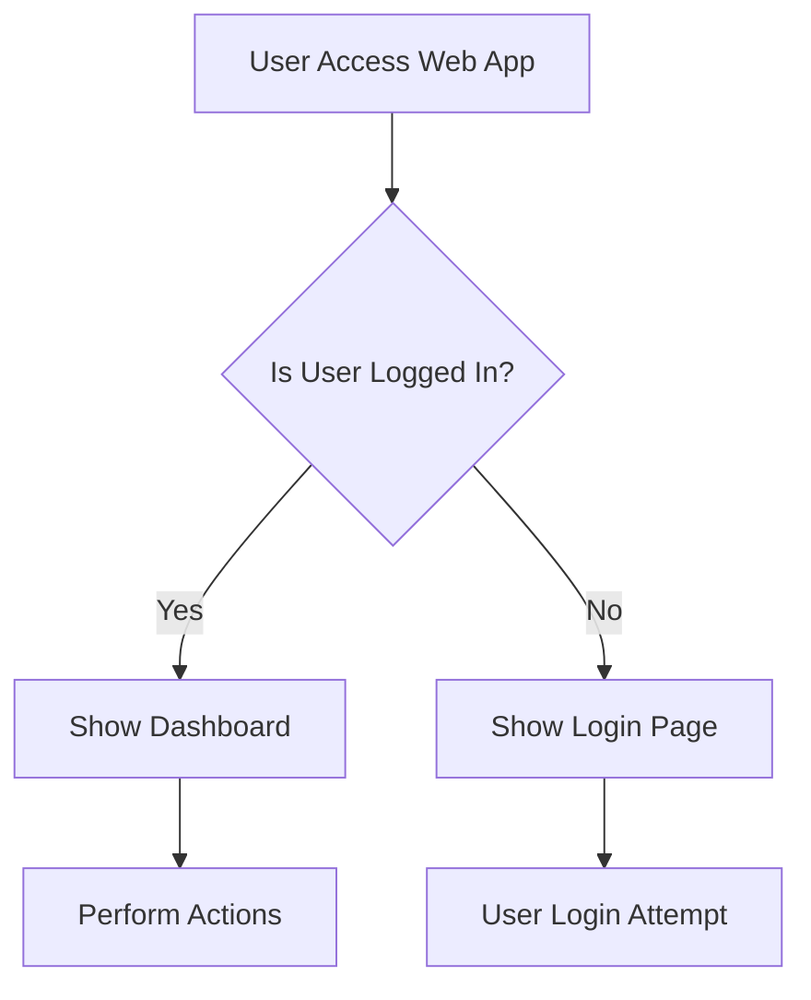
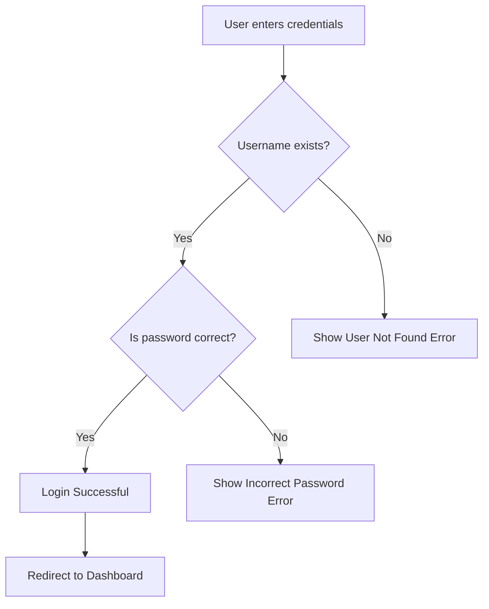
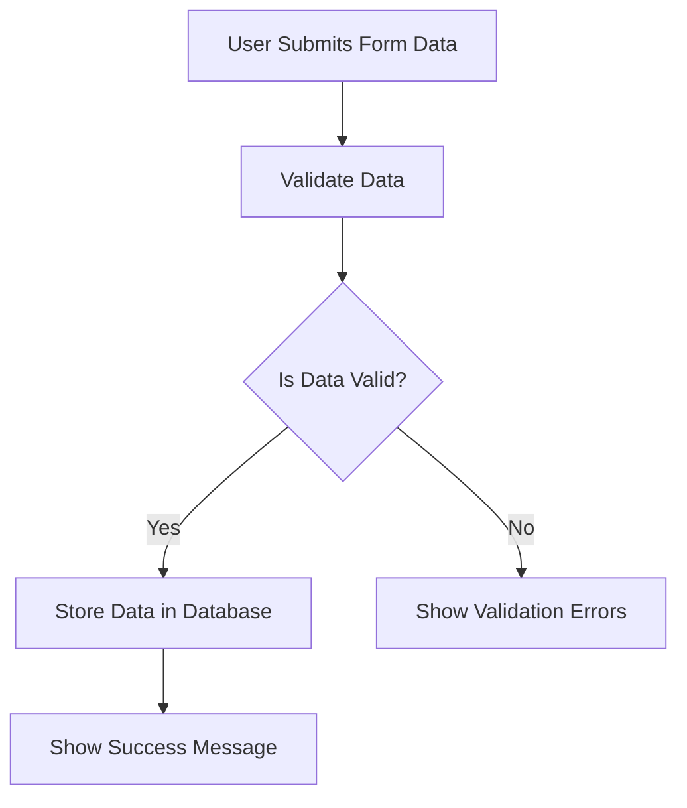
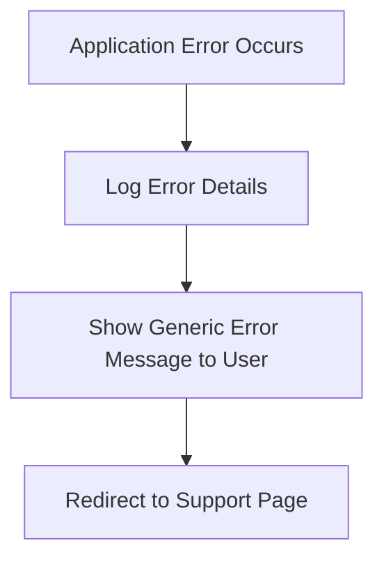
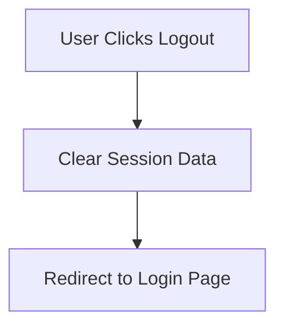

## ✅ Application Flow - High Level Overview

---

## ✅ User Login Flow

---

## ✅ Data Submission Flow

---

## ✅ Error Handling Workflow

---

## ✅ Logout Workflow

---

## 📌 Notes

- All diagrams use Mermaid syntax.
- Previewable in VS Code via **Markdown Preview Mermaid Support** extension.
- Can be visualized via [Mermaid Live Editor](https://mermaid-js.github.io/mermaid-live-editor/).