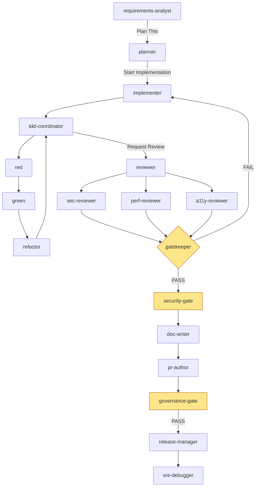

# Custom Copilot Agents for the SDLC — Multi‑Agent Orchestration, Status Transfer & Validation

A practical reference for building a **local** custom‑agent fleet in GitHub Copilot that covers the full software development lifecycle, hands work between specialized agents, validates each step, and runs identically in **VS Code** and **JetBrains / IntelliJ** IDEs.

---

## 1. Mental model

A custom agent = one Markdown file with YAML frontmatter (`*.agent.md`). The frontmatter is the **contract** (identity, model, tool allow‑list, MCP servers, handoffs); the body is the **behavior** (instructions + definition‑of‑done).

You compose agents three ways. Pick per step — most real pipelines mix all three.

| Pattern | Who decides the transition | Control | Best for | Key knob |
|---|---|---|---|---|
| **Handoffs** | Human clicks a button | High (human‑in‑the‑loop) | Gated SDLC stages, approvals | `handoffs:` frontmatter |
| **Subagent delegation** | Coordinator agent, explicit | Medium | Structured, repeatable pipelines, parallel reviewers | `tools: ['agent']` + `agents: [...]` |
| **Automatic delegation** | Agent decides at runtime | Low | Adaptive, context‑dependent work | inherit tools, no allow‑list |

Guardrails that always apply locally: every tool call can be approved/denied, you set an autonomy level, and you can enable OS‑level agent sandboxing to restrict file system + network. Subagents can't spawn subagents by default (max nesting depth 5).

> **Scope note:** `handoffs` and `argument-hint` work in IDE/local agents but are **ignored by the Copilot cloud agent on github.com**. Everything below targets the local fleet; the same `.agent.md` files still load in the cloud agent, just without the handoff buttons.

---

## 2. The full SDLC agent roster

One specialized agent per stage. Each is a separate `*.agent.md`. Tool lists are deliberately **least‑privilege** — read‑only agents never get `editFiles` or write‑capable MCP tools.

### Stage map

```
Discover → Plan/Design → Scaffold → Implement → Test(R/G/Refactor) →
Review(sec/perf/a11y) → Security/SAST → Docs → DB/Migrations →
Build/CI → PR → Release → Observe/Debug → Modernize/Maintain → Govern
```

### 2.1 Requirements Analyst (Discovery)
```markdown
---
name: requirements-analyst
description: Turn a ticket into testable acceptance criteria + open questions.
model: ['Claude Opus 4.5', 'GPT-5.2']
tools: ['search', 'fetch', 'jira/get_issue', 'confluence/search']
handoffs:
  - label: Plan This
    agent: planner
    prompt: Produce a design + ADR for the criteria above.
---
Read the linked ticket. Output: (1) restated problem, (2) numbered acceptance
criteria in Given/When/Then, (3) explicit non-goals, (4) open questions.
Do NOT propose code. Write results to .sdlc/<ticket>.md under "## Requirements".
```

### 2.2 Planner / Architect (Plan & Design)
```markdown
---
name: planner
description: Generate an implementation plan + ADR before any code changes.
model: ['Claude Opus 4.5', 'GPT-5.2']
tools: ['search', 'usages', 'githubRepo', 'fetch']
handoffs:
  - label: Start Implementation
    agent: implementer
    prompt: Implement the plan in .sdlc/<ticket>.md, one task at a time.
---
Analyze the codebase for affected modules. Produce: phased task list,
risk/rollback notes, and an ADR (context → decision → consequences) using
least-privilege + existing patterns. Append to .sdlc/<ticket>.md under "## Plan".
Never edit source files.
```

### 2.3 Scaffolder (Setup)
```markdown
---
name: scaffolder
description: Create folders, boilerplate, configs, and feature flags for the plan.
tools: ['editFiles', 'runCommands', 'github/*']
---
Create only the skeleton named in the plan (files, stubs, flag wiring, empty tests).
No business logic. Run the formatter and commit on a feature branch.
```

### 2.4 Implementer (Build)
```markdown
---
name: implementer
description: Implement features task-by-task following the plan and existing patterns.
model: ['Claude Opus 4.5', 'GPT-5.2']
tools: ['editFiles', 'search', 'usages', 'runCommands', 'terminalLastCommand', 'postgres/query']
handoffs:
  - label: Write Tests
    agent: test-writer
    prompt: Add unit + integration tests for what was just implemented.
  - label: Request Review
    agent: reviewer
---
Implement ONE plan task at a time. After each task: build, run affected tests,
self-correct on failures. Update .sdlc/<ticket>.md task checkboxes. Stop and ask
before touching auth, migrations, or anything outside the plan's scope.
```

### 2.5 TDD trio — Red / Green / Refactor (Test)
A coordinator drives these as **subagents** for a clean red→green→refactor loop.
```markdown
---
name: tdd-coordinator
description: Drive test-driven development through specialized subagents.
tools: ['agent']
agents: ['red', 'green', 'refactor']
---
1. Use `red` to write a failing test for the next acceptance criterion.
2. Use `green` to make it pass with the minimal change.
3. Use `refactor` to clean up while keeping tests green.
Repeat until all criteria in .sdlc/<ticket>.md are covered.
```
```markdown
---
name: red
description: Write a single failing test. Read-only on source.
tools: ['editFiles', 'runCommands']
---
Write exactly one focused failing test that encodes the next criterion. Run it,
confirm it fails for the right reason, then stop.
```
```markdown
---
name: green
description: Minimal implementation to pass the failing test.
tools: ['editFiles', 'runCommands']
---
Make the failing test pass with the smallest change. No extra features. Run the suite.
```
```markdown
---
name: refactor
description: Improve structure without changing behavior.
tools: ['editFiles', 'runCommands', 'usages']
---
Refactor for clarity/duplication only. Tests must stay green at every step.
```

### 2.6 Multi‑perspective Reviewer (Code Review)
Run specialized reviewers **in parallel** and synthesize.
```markdown
---
name: reviewer
description: Coordinate parallel security, performance, and accessibility review.
tools: ['agent']
agents: ['sec-reviewer', 'perf-reviewer', 'a11y-reviewer']
handoffs:
  - label: Fix Findings
    agent: implementer
    prompt: Address the prioritized review findings above.
---
Delegate the diff to all three reviewers in parallel. Merge findings into a single
table ranked by severity. Block handoff if any "critical" remains.
```
```markdown
---
name: sec-reviewer
description: OWASP-focused review. Read-only.
tools: ['search', 'usages', 'semgrep/scan']
---
Review only the changed files for injection, authz gaps, secrets, unsafe deserialization.
Return findings with file:line, severity, and a concrete fix. Do not edit code.
```
*(perf‑reviewer and a11y‑reviewer follow the same read‑only shape with their own lens.)*

### 2.7 Security / SAST gate (Security)
```markdown
---
name: security-gate
description: Run SAST + dependency + secret scans and gate the pipeline.
tools: ['semgrep/scan', 'github/list_dependabot_alerts', 'runCommands']
---
Run SAST, SCA, and secret scanning on the branch. Emit PASS/FAIL with a findings
table. On FAIL, write blockers to .sdlc/<ticket>.md under "## Security" and stop.
```

### 2.8 Documentation agent (Docs)
```markdown
---
name: doc-writer
description: Update README, API docs, ADRs, and changelog for the change.
tools: ['editFiles', 'search', 'githubRepo']
---
Update only docs affected by the diff. Keep ADRs in /docs/adr. Generate/refresh
API reference from code. Add a changelog entry. Never touch source logic.
```

### 2.9 Database / Migrations agent (Data)
```markdown
---
name: db-migrator
description: Author reversible migrations and validate against a scratch DB.
tools: ['editFiles', 'runCommands', 'postgres/query']
---
Generate forward + rollback migrations. Run against a disposable schema, verify
up/down idempotency, and capture the diff. NEVER run DDL/DML against prod or
shared envs. Flag any breaking column change for human approval.
```

### 2.10 Build / CI agent (Integrate)
```markdown
---
name: ci-engineer
description: Create/repair CI workflows and make the build green.
tools: ['editFiles', 'runCommands', 'github/*']
---
Author or fix the CI pipeline (build, lint, test, scan stages). Reproduce failures
locally, fix, and confirm green. Keep secrets in repo/org variables, never inline.
```

### 2.11 PR agent (Submit)
```markdown
---
name: pr-author
description: Open a well-formed PR linked to the ticket with a complete summary.
tools: ['github/*']
handoffs:
  - label: Release
    agent: release-manager
---
Create the PR: title, ticket link, what/why/how, test evidence, screenshots,
rollback plan, and a filled review checklist. Request the right reviewers.
```

### 2.12 Release manager (Deploy)
```markdown
---
name: release-manager
description: Cut release notes, tag, and prep deployment artifacts.
tools: ['github/*', 'runCommands']
---
Assemble release notes from merged PRs, bump version, create the tag/draft release.
Produce a deploy checklist + rollback steps. Do not trigger prod deploy without
explicit human approval.
```

### 2.13 Observability / Debug agent (Operate)
```markdown
---
name: sre-debugger
description: Triage incidents and runtime errors using logs/metrics/traces.
tools: ['search', 'runCommands', 'grafana/query', 'sentry/list_issues']
---
Given an error or alert: correlate logs/metrics/traces, form a hypothesis, locate
the suspect code path, and propose a minimal fix + test. Read-only on infra.
```

### 2.14 Modernization / Maintenance agent (Evolve)
```markdown
---
name: modernizer
description: Dependency upgrades, framework migrations, dead-code + refactor.
tools: ['editFiles', 'runCommands', 'usages', 'github/*']
---
Upgrade in small, independently reviewable steps. After each: build + full test +
scan. Produce a migration ADR. Long-running — raise max requests/turn before starting.
```

### 2.15 Governance / Compliance gate (Govern)
```markdown
---
name: governance-gate
description: Enforce org policy (license, data handling, change control) before merge.
tools: ['search', 'github/*', 'semgrep/scan']
---
Check license compatibility, PII handling, branch-protection compliance, and required
approvals. Emit a signed PASS/FAIL summary to the PR. FAIL blocks the release handoff.
```

---

## 3. Transferring status between agents

Handoffs carry the **conversation context** automatically, but for an auditable enterprise pipeline you want explicit, machine‑checkable state. Use a two‑layer convention.

### Layer 1 — Handoff frontmatter (the UI transition)
The button passes context + an optional priming prompt to the next agent:
```yaml
handoffs:
  - label: Start Implementation
    agent: implementer
    prompt: Implement the plan in .sdlc/<ticket>.md. Update checkboxes as you go.
```

### Layer 2 — The task ledger (the durable contract)
Every agent reads and writes one file per work item: `.sdlc/<ticket>.md`. This is the **handoff contract** — the source of truth that survives context compaction and lets any agent (or human) resume.

```markdown
# TICKET-1234 — Add provider registration flow

## Status
stage: review          # discovery|plan|scaffold|implement|test|review|security|docs|release
owner-agent: reviewer
updated: 2026-06-12T10:00:00Z

## Requirements        # filled by requirements-analyst
- [x] AC1: Given ... When ... Then ...

## Plan                # filled by planner  (+ ADR link)
- [x] Task 1: schema
- [x] Task 2: API
- [ ] Task 3: UI

## Implementation log   # appended by implementer
- Task 1 done (commit abc123), tests green

## Gates                # each gate writes PASS/FAIL + evidence
- security: PASS (0 critical)
- review:   PENDING
- governance: —
```

**Rule baked into every agent prompt:** *"Before doing work, read `.sdlc/<ticket>.md`. Refuse to proceed if the `stage` doesn't match your role. After work, update your section, advance `stage`, and stamp `updated`."* This turns status transfer into an explicit gate rather than implicit trust.

---

## 4. Validating each step (gates)

Three complementary mechanisms — use all three for defense in depth.

### 4.1 In‑prompt Definition of Done
Each agent's body ends with a checklist it must satisfy before offering a handoff (build passes, affected tests green, ledger updated, no scope creep). This is the cheapest gate.

### 4.2 A dedicated Validator agent between stages
```markdown
---
name: gatekeeper
description: Validate the previous stage's output before allowing the next handoff.
tools: ['runCommands', 'search', 'github/get_pull_request']
handoffs:
  - label: Proceed
    agent: pr-author
---
Verify against .sdlc/<ticket>.md: all plan tasks checked, suite green, lint clean,
security gate PASS, docs updated. Output a PASS/FAIL report. On FAIL, list exactly
what is missing and hand back to the responsible agent — do not advance.
```

### 4.3 Agent hooks (automated, non‑negotiable enforcement)
Hooks run shell commands at key lifecycle points (session start, before/after a tool call, before handoff). Use them to **enforce** policy regardless of what the model decides — e.g. run tests + lint and block if they fail, or verify the ledger `stage` was advanced. Hooks are the enterprise control point: they don't rely on the model "remembering" to validate.

```
pre-handoff hook:  npm test && npm run lint && ./scripts/check-ledger.sh <ticket>
                   # non-zero exit blocks the transition
```

---

## 5. End‑to‑end orchestration

A top‑level **coordinator** drives the happy path via subagents, while humans keep approval control at the risky gates via handoffs.



Coordinator profile that wires the structured part:
```markdown
---
name: sdlc-coordinator
description: Drive a feature from ticket to PR through the agent fleet.
tools: ['agent']
agents: ['requirements-analyst','planner','implementer','tdd-coordinator','reviewer','gatekeeper','security-gate','doc-writer','pr-author']
---
Read .sdlc/<ticket>.md. Advance the pipeline one stage at a time, calling the agent
that owns the current stage. After each stage, call `gatekeeper`. Never skip a gate.
Surface to the human at: plan approval, any migration, and before PR.
```

---

## 6. Configuration — VS Code

### 6.1 Where agent files live
Put profiles in your workspace (e.g. `.github/agents/*.agent.md`) so they're version‑controlled and shared with the team. The location is governed by the `chat.agentFilesLocations` setting. *(Custom agents were formerly "chat modes" — rename any `.chatmode.md` to `.agent.md`.)*

### 6.2 MCP servers — `.vscode/mcp.json`
Multiple servers are just multiple keys. Supports `stdio` (local), `sse`/`http` (remote), and `${input:...}` for secrets.
```jsonc
{
  "mcpServers": {
    "github":    { "type": "stdio", "command": "docker",
                   "args": ["run","-i","--rm","-e","GITHUB_TOKEN","ghcr.io/github/github-mcp-server"],
                   "env": { "GITHUB_TOKEN": "${input:gh_token}" } },
    "playwright":{ "type": "stdio", "command": "npx", "args": ["-y","@playwright/mcp"] },
    "semgrep":   { "type": "stdio", "command": "npx", "args": ["-y","@semgrep/mcp"] },
    "postgres":  { "type": "stdio", "command": "npx", "args": ["-y","@your-org/pg-mcp"],
                   "env": { "DATABASE_URL": "${input:db_url}" } },
    "jira":      { "type": "sse",  "url": "https://jira-mcp.internal/sse" },
    "grafana":   { "type": "http", "url": "https://grafana-mcp.internal/mcp" }
  },
  "inputs": [
    { "id": "gh_token", "type": "promptString", "description": "GitHub token", "password": true },
    { "id": "db_url",   "type": "promptString", "description": "Scratch DB URL", "password": true }
  ]
}
```

### 6.3 Settings that matter for a fleet
| Setting | Why |
|---|---|
| `chat.agentFilesLocations` | Where `.agent.md` files are discovered |
| `chat.subagents.allowInvocationsFromSubagents` | Let subagents delegate further (past depth‑1) |
| `github.copilot.chat.organizationCustomAgents.enabled` | Discover org‑published agents |
| Agent sandboxing / permission level | Restrict FS + network; set autonomy you're comfortable with |

### 6.4 Authoring shortcuts
Use the **Agent Customizations editor (Preview)** to create/manage agents, prompt files, and skills in one place. Pick the right tool: **custom agents** for persistent personas with tool restrictions + handoffs; **prompt files** for one‑off tasks; **agent skills** for portable, scripted capabilities.

---

## 7. Configuration — JetBrains / IntelliJ (and Eclipse/Xcode)

Custom agents, sub‑agents, and the plan agent are **GA** in Copilot for JetBrains; agent hooks are in preview. The **same `.agent.md` files** are used — author them via UI or drop them in the workspace.

### 7.1 Create / manage agents
Open **Copilot Chat → agents dropdown (bottom of chat) → Configure Agents… → Chat Agents → Workspace**, then enter a file name. Use **Configure Tools…** to pick built‑in + MCP tools into the profile, and add a `model:` line via autocomplete. Re‑open the same dropdown → **Configure Custom Agents** to edit.

### 7.2 MCP servers
Two equivalent routes:
- **UI:** GitHub Copilot icon → **Edit settings → MCP Servers** section. Paste the same `mcp.json` shape as VS Code.
- **Auto‑approve:** **Settings → GitHub Copilot → Chat → MCP Server and Tool Auto‑approve Configuration** — set auto‑approve at server or tool level to cut manual prompts during long agent runs. Scope this tightly for write‑capable tools.

### 7.3 Instruction files
JetBrains supports **`AGENTS.md`** and **`CLAUDE.md`** instruction files (and can generate an initial `AGENTS.md`). Use `AGENTS.md` for repo‑wide conventions the whole fleet inherits (coding standards, the ledger rule, the least‑privilege policy).

### 7.4 Long‑running pipelines
Raise **max requests per turn** in Agent Mode from the default **25 → 100** for modernization/migration agents that loop many times. (Settings → GitHub Copilot.)

### 7.5 CLI option
Copilot **CLI** now ships inside JetBrains with an agent picker (Agent / Plan modes), `/fleet` for launching subagents, and `/remote` to steer sessions from github.com or mobile. CLI MCP config lives in `~/.copilot/mcp-config.json` (accepts both `mcpServers` and the flat Claude‑style format; stdio/SSE/remote‑OAuth).

### VS Code vs JetBrains at a glance
| Concern | VS Code | JetBrains / IntelliJ |
|---|---|---|
| Agent files | `.agent.md` in `chat.agentFilesLocations` | Same files; UI: Configure Agents → Workspace |
| MCP config | `.vscode/mcp.json` | Copilot icon → Edit settings → MCP Servers |
| Instruction files | `copilot-instructions.md`, `AGENTS.md` | `AGENTS.md`, `CLAUDE.md` (auto‑gen supported) |
| MCP auto‑approve | tool approval UI | Chat → MCP Server & Tool Auto‑approve |
| Subagents / handoffs | GA | GA |
| Long runs | requests/turn setting | requests/turn 25 → 100 |

---

## 8. MCP server map for the SDLC

| Stage | MCP server(s) | Typical tools (scope) |
|---|---|---|
| Discover | Jira / Azure DevOps, Confluence | read issue, search docs (read‑only) |
| Plan | GitHub, repo search | read repo, list code (read‑only) |
| Implement | GitHub, Filesystem | branch, commit, file ops |
| Test | Playwright | navigate, screenshot, assert |
| Review/Security | Semgrep, Dependabot/GitHub | scan, list alerts (read‑only) |
| Data | Postgres/Oracle MCP | query, migrate (scratch only) |
| CI/Release | GitHub | workflows, PR, releases |
| Operate | Grafana, Sentry/Datadog | query metrics/logs/traces (read‑only) |

**Least‑privilege rule:** the agent's `tools:` list is the security boundary — name exact tools, never `*`, for anything that mutates state. Once a server is configured, Copilot may use its tools **without asking**, so the allow‑list and read‑only scoping are doing real safety work, not just hygiene.

---

## 9. Recommended repo layout

```
.github/
  copilot-instructions.md        # global standards (or AGENTS.md)
  agents/
    requirements-analyst.agent.md
    planner.agent.md
    implementer.agent.md
    tdd-coordinator.agent.md   red.agent.md  green.agent.md  refactor.agent.md
    reviewer.agent.md          sec-reviewer.agent.md  perf-reviewer.agent.md  a11y-reviewer.agent.md
    security-gate.agent.md     gatekeeper.agent.md
    doc-writer.agent.md        db-migrator.agent.md   ci-engineer.agent.md
    pr-author.agent.md         release-manager.agent.md
    sre-debugger.agent.md      modernizer.agent.md    governance-gate.agent.md
    sdlc-coordinator.agent.md
  hooks/
    pre-handoff.sh             # tests + lint + ledger check
AGENTS.md                      # JetBrains-friendly mirror of conventions
.vscode/mcp.json
.sdlc/                         # one ledger file per ticket (the handoff contract)
```

---

## 10. Enterprise rollout notes

- **Publish org‑level agents** so every repo inherits the vetted fleet; enable discovery via the org custom‑agents setting / policy. MCP usage is **disabled by default** for orgs/enterprises — an admin must enable it.
- **Pin model + fallback** per agent (`model: ['Claude Opus 4.5','GPT-5.2']`) so behavior is reproducible across the team.
- **Secrets** come from repo/org variables and `${input:...}` / `${{ secrets.* }}` — never inline in `mcp.json` or the agent body.
- **Hooks + gatekeeper** are your non‑bypassable controls; the model can't talk its way past a failing hook.
- **Start small:** ship planner → implementer → reviewer → pr-author first, prove the handoff + ledger loop, then add the gates and the long‑tail agents.
