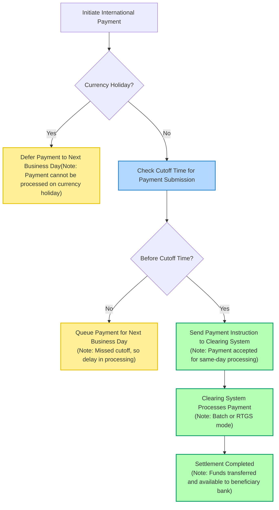

# International Payment Workflow: Currency Holidays and Cutoff Times

This document explains the concepts of **currency holidays**, **cutoff times**, and their impact on clearing and settlement in international payment rails.

---

## Workflow Diagram

---

## Key Notes

- **Initiate Payment:** The sender begins a cross-border/international transaction.
- **Currency Holiday Check:** If today is a non-settlement day for any involved currency, the payment is deferred to the next business day.
- **Cutoff Time Check:** Payments must be submitted before the cutoff time for same-day processing. After the cutoff, they queue for the next valid day.
- **Clearing System:** Payments are routed through appropriate clearing/settlement rails—batch (ACH) or real-time (RTGS).
- **Settlement Completion:** Once cleared, funds are made available to the beneficiary bank/account.

## Concepts Explained

- **Currency Holiday:** A day when specific currency settlements do not occur due to local holidays. Payments involving that currency are paused.
- **Cutoff Time:** The latest allowable time for submitting payment instructions for same-day processing. Transactions after this time are processed the following day.
- **Clearing & Settlement Systems:** Infrastructure (such as RTGS, ACH) handling payment processing. Each system has its own cutoff times and may process payments in batches or real time.

---

This markdown file provides a visual and logical explanation of how currency holidays and cutoff times affect the process and timeline of international payments and settlements.
