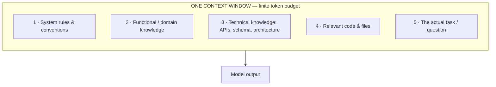
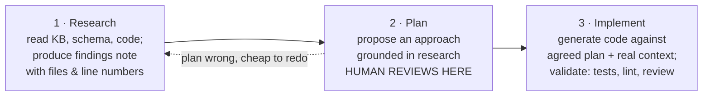

# How GenAI Models Work — and What to Feed Them

Before we capture any knowledge, the team needs a correct mental model of what a GenAI model is. Almost every failure with Copilot traces back to a wrong assumption about what the model can see and remember.

## The model is a next-token predictor

Strip away the magic and a large language model (LLM) is a function that reads everything in front of it and predicts the most likely next piece of text. Four consequences flow from that, and they shape everything we do.

**1. It is a pure function of its input.** Same context in, similar output out. It has no hidden access to our repositories, Jira, runbooks, or wikis — only what we place in the prompt. Output quality is capped by input quality.

**2. It has no memory between calls.** Every request starts from zero. Anything the model must "know" has to be supplied again, every single time. It does not remember yesterday's conversation, and another instance helping a teammate shares nothing with yours.

**3. It is confident, not correct.** When context is missing, the model does not return an error — it fills the gap with a plausible invention. This is what a "hallucination" is: missing context turned into confident fiction. On bespoke legacy systems, this shows up as invented APIs that look completely real.

**4. It is stochastic and cutoff-bound.** Outputs vary run to run, and the model's built-in knowledge is frozen at a training cutoff. It is structurally blind to our private code and to this week's architecture decision.

> **Presenter note:** the takeaway is a reframing — the model is not a database and not a colleague who remembers. It is a function. Our job is not to make it smarter; it is to make its input complete and current.

## The context window is the model's entire world

Everything the model considers — instructions, our knowledge, the code, the question — must fit inside one finite **context window**. It only knows what is in front of it, right now.

If it is not in the window, the model cannot use it. Full stop.

A common and expensive mistake is to assume that a bigger window means "feed it everything." The opposite is true. Dumping the whole user manual plus every ticket degrades reasoning — the model loses the signal in the noise. The named failure mode is **context rot**: performance decays as the window fills with poorly-curated material. The skill is *selecting and structuring* the right context, not maximising volume.

## The shift: from prompt engineering to context engineering

Writing a clever prompt optimises a *single interaction*. Engineering context optimises *the entire system* that feeds every interaction. By 2026 the second has become the discipline that decides quality at scale — industry surveys report that the largest organisations (10,000+ employees) cite "managing context at scale" as their number-one quality barrier with AI agents. That is precisely our situation.

| | Prompt engineering | Context engineering |
|---|---|---|
| **Optimises** | one message | the whole system |
| **Lives** | in one chat, not reusable | versioned, owned, reused across the team |
| **Durability** | breaks when the task or code changes | defends against drift and context rot |
| **For production** | necessary but not sufficient | the actual practice |

The word that matters is **system**. We are building a pipeline — Markdown knowledge base → MCP → Copilot — not crafting individual prompts. Context becomes a versioned, owned, tested asset, with the same rigour we apply to code.

## What to feed the model — the five context types

Effective context is layered. Get all five right and the model behaves like an engineer who already knows our system; miss one and it falls back to guessing.

1. **Instructions & rules** — how we work: coding standards, conventions, security rules, "preferred vs avoid" patterns, Definition of Done. (In Copilot this is `.github/copilot-instructions.md` and prompt files.)
2. **Functional knowledge** — what the product does and *why*: business rules, domain glossary, user journeys, regulatory and compliance constraints.
3. **Technical knowledge** — how it is built: architecture, data models, API contracts, integration points, Architecture Decision Records, known anti-patterns and gotchas.
4. **Task specification** — the concrete ask: the goal, acceptance criteria, relevant files, and the expected shape of the output. (A good ticket.)
5. **Live tool access** — real-time reach via MCP: query the knowledge base, look up a ticket, read the schema, check CI — instead of stale paste-ins. **This is the bridge to MCP.**

Layers 2 and 3 are exactly what we will capture as Markdown (file 02). Layer 5 is how we serve it (file 03).

## Don't one-shot it — Research → Plan → Implement

The biggest accuracy gains come from how you sequence the work, not from a single magic prompt. Make the model research and plan with our knowledge *before* it writes a line.

The **Plan gate** is where humans add the most leverage. Catching a wrong approach in a 10-line plan is far cheaper than reviewing 300 lines of wrong code. This loop only works if step 1 has good material to read — which is the knowledge base we build next.

> **Presenter note:** this mirrors how a good senior engineer onboards onto unfamiliar legacy code: understand first, agree an approach, then change things. We are asking the agent to do the same.
