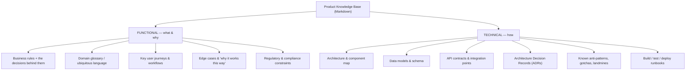

# Capturing Product Knowledge as Markdown

We need a format that humans will actually maintain and that machines read natively. Markdown hits both. It turns documentation from a write-once, read-rarely artifact into a first-class, versioned engineering asset — "docs as code."

## Why Markdown is the right substrate

**Human and machine readable.** Engineers write it in any editor; LLMs and agents parse it natively — no conversion, no lossy export.

**Lives in Git, next to the code.** It is version-controlled, diff-able, and reviewed in pull requests. Documentation changes in the *same commit* as the code it describes, so the two stop drifting apart.

**Progressive disclosure.** Headings and metadata let an agent skim a file and pull only the section it needs, instead of loading the whole document. This directly protects the context budget discussed in file 01.

**Plain text is future-proof.** No vendor lock-in. The same files feed Copilot today and any MCP-aware tool tomorrow; they outlive any single platform.

> Why not Confluence, Word, or SharePoint? Those are hard for tools to consume cleanly, easy to leave stale, and they live away from the code. Markdown in the repo is reviewed like code, versions with the code, and is trivially machine-readable.

## What knowledge to capture

Two halves of the same picture. Capture both deliberately — the **functional** "what and why" that legacy teams hold in their heads, and the **technical** "how" scattered across the system.



Make this concrete with our own products. **Functional** is the stuff nobody can answer when the senior engineer is on leave — why a rule exists, which edge cases are deliberate, what compliance forces. **Technical** is the architecture and contracts that are "obvious" to veterans and opaque to everyone else, plus the landmines ("never touch X without Y").

For legacy systems, **ADRs and an explicit anti-patterns section are disproportionately valuable** — they encode hard-won lessons that are otherwise lost. Prioritise the knowledge that is highest-risk if the person holding it leaves.

## Anatomy of a good knowledge file

Structure matters as much as content. A well-formed file is easy for humans to maintain and lets an agent pull exactly what it needs.

````markdown
---
title: Payments Engine
owner: payments-team
last_updated: 2026-05
scope: payments
reviewed_by: arch-guild
---

# Payments Engine

## Purpose & business rules
Settlement must net intra-day before the cut-off window; partial
settlement is forbidden for regulated counterparties (why: reg X).

## Architecture
Ledger service → Risk gate → Rail adapter. The ledger is the
source of truth; rails are never called directly.

## API contract
POST /v2/settle — requires an idempotency-key header.

## Preferred
```java
railAdapter.submit(settlement, idempotencyKey); // goes via the adapter
```

## Avoid
```java
rail.sendDirect(settlement); // bypasses risk gate + retries; do not do this
```
````

Four elements make it work:

- **Metadata header** (`owner`, `last_updated`, `scope`, `reviewed_by`) tells both humans and agents whether the file is trustworthy and current. This is the primary defence against context rot — a stale `last_updated` is a signal to distrust the file.
- **Clear headings**, one concept per section, so an agent can fetch a single section rather than the whole file (progressive disclosure).
- **Preferred / Avoid blocks with real code** — per practitioners, the single most effective element for steering generation. Show the right way *and* the wrong way.
- **Explain the "why."** A brief rationale lets the model apply a rule correctly in edge cases the document did not spell out, rather than copying blindly.

A copy-paste starter is in [`knowledge-file-template.md`](knowledge-file-template.md).

> **Presenter note:** walk the template live. The "Preferred / Avoid with actual code" pattern is the highest-leverage habit to instil in the team — it is worth more than pages of prose.
