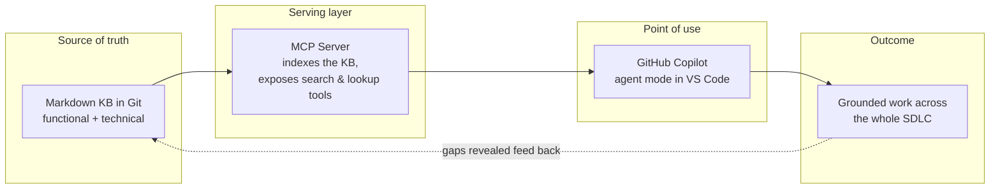
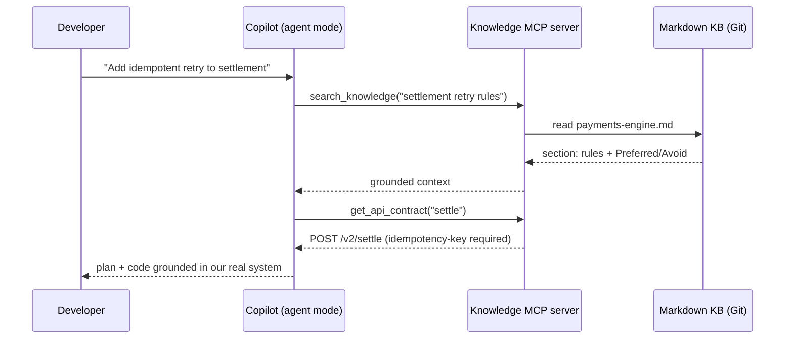
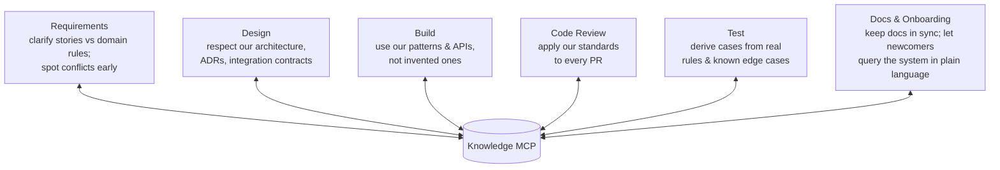

# MCP and GitHub Copilot

Once our knowledge lives in Markdown, the question is how the model gets it on demand instead of relying on a stale paste-in. The answer is the **Model Context Protocol (MCP)**.

## MCP in plain terms

MCP is an open standard for connecting AI models to external tools, data, and services through one uniform interface. It is now stewarded under the Linux Foundation, which makes it a durable industry bet rather than a single-vendor experiment.

The useful analogy is **"USB-C for AI tools."** Before USB-C, every device had its own connector. MCP is the single connector standard for plugging knowledge and tools into AI models: build the connector to our knowledge base once, and any MCP-aware tool — Copilot today, others tomorrow — can use it without a custom integration each time.

A few facts that matter for us:

- **An MCP server exposes tools.** It publishes capabilities — for example `search_knowledge`, `get_api_contract`, `get_schema`, `lookup_ticket` — that the agent invokes on demand.
- **GitHub Copilot agent mode supports MCP, generally available** in VS Code (and Visual Studio). The agent can call MCP tools to fetch context without leaving the editor and loop until the task is done.
- **Custom instructions stack on top.** `.github/copilot-instructions.md` and prompt files guide *how* the agent behaves, alongside the tools it can call.
- **Enterprise MCP is governed by policy and disabled by default** — administrators must approve and whitelist servers. (Covered in file 04; loop in platform/security early.)

## The architecture: docs → MCP → Copilot → SDLC

The single most important idea: **write knowledge once, serve it everywhere.** We stop pasting docs into chats; the agent fetches the current version itself, every time.

## What a request actually looks like

Notice the model is no longer guessing the settle endpoint or the retry rule. It asks the knowledge base, live, and works from the answer.

## Where the knowledge MCP plugs into the SDLC

The same knowledge base pays off at every phase — not just code generation. Each phase asks the model a different question; the MCP answers it with our real context.

Two points worth stressing:

- This is **not "just for writing code faster."** The knowledge base compounds across the entire lifecycle.
- **Code review** specifically: Copilot code review now supports MCP and agent skills (public preview as of mid-2026), so the same context that guides generation also enforces our standards on every pull request — directly attacking the "senior engineers are the review bottleneck" problem.

> **Presenter note:** pick the one or two phases most relevant to our team and tell a concrete story end-to-end, ideally with a real ticket and a real file from the pilot product.
