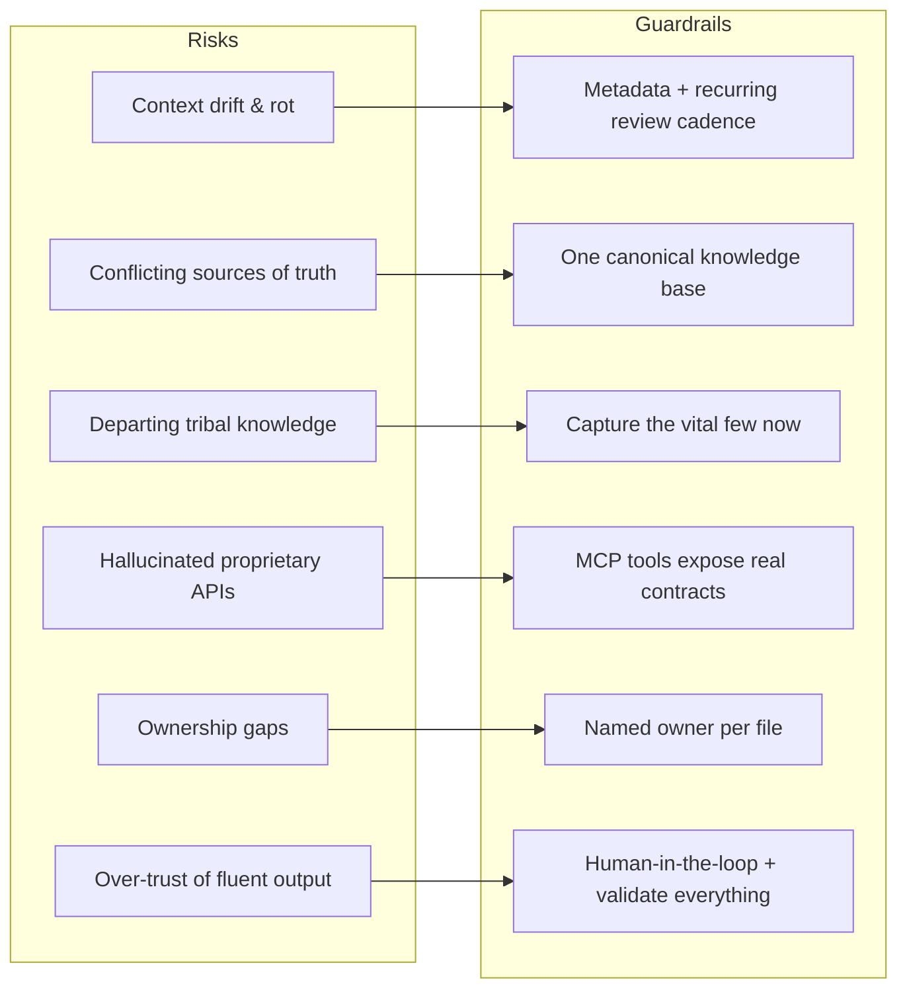
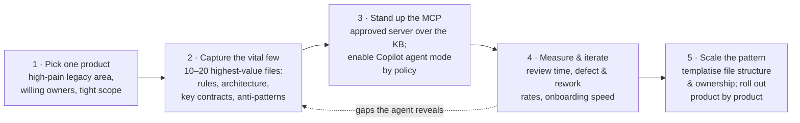

# Legacy Products at Scale — Issues, Governance & Rollout

This is where it gets real for us. Functionality layered up over years, across big teams, creates failure modes that a small greenfield team never sees. These are not reasons to avoid the approach — they are the reasons we must do it *deliberately*.

## The hard part: failure modes for legacy & large teams

**Context drift & rot.** Conventions evolve but the docs do not — so agents generate code to outdated practices, breeding inconsistency and technical debt.

**Conflicting sources of truth.** Years of wikis, READMEs, and decks disagree. The model cannot tell which is current, so it averages them into something subtly wrong.

**Tribal & departing knowledge.** Critical "why" lives with a few veterans. When they leave, the knowledge base is the only thing that remembers.

**Hallucination on proprietary APIs.** The more bespoke and legacy the system, the more confidently the model invents interfaces that do not exist.

**Ownership gaps at scale.** With many teams touching one product, "who owns this doc" is unclear — so nothing gets reviewed or kept current.

**Over-trust of fluent output.** Confident, well-formatted code lowers reviewers' guard — especially risky in regulated, high-blast-radius systems.

## Governance & guardrails — the enterprise non-negotiables

In a regulated bank, the controls are not optional extras; they are what makes this allowed. Each guardrail answers one of the risks above.

The non-negotiables, stated plainly:

- **MCP is off by default — enable it by policy.** Enterprise MCP use is disabled until administrators approve it. Whitelist trusted servers and treat each like a dependency. Involve platform/security before the pilot.
- **Never feed secrets or PII.** No credentials, keys, customer data, or regulated PII in the knowledge base or context. **Knowledge ≠ data** — keep that line bright.
- **Every file has an owner and a review cadence.** Metadata (`owner`, `last_updated`, `reviewed_by`) plus a recurring review beats context rot. Stale equals untrusted.
- **Human-in-the-loop on output.** The agent proposes; humans approve. Keep the Plan gate (file 01) and mandatory review, especially on high-blast-radius code.
- **Validate, don't trust.** Tests, lint, security scans, and review apply to AI output exactly as to human output. No exceptions for fluency.
- **Audit & least privilege on MCP tools.** Scope what each server can read or do, and log tool calls. The agent gets the minimum access needed, nothing more.

## Making it stick — the team operating model

A knowledge base only helps if it stays alive. Bake maintenance into how the scrum team already works, so capture is not a side project that rots.

- **Knowledge in the Definition of Done.** If a change alters behaviour, an architecture, or a contract, updating the relevant `.md` is part of the *same* pull request — not a follow-up ticket.
- **Clear ownership per domain.** Each knowledge area has a named owning team, visible in the file metadata and in review.
- **Review cadence & drift checks.** A light recurring review (per sprint or per release) flags stale files; old `last_updated` dates surface in the retro.
- **Dogfood it in ceremonies.** Use the MCP-backed agent during refinement and design. When it cannot answer a question, you have just found the next doc to write.

> **Presenter note:** the number-one reason these efforts fail is that the knowledge base goes stale and people stop trusting it. The fix is to treat it like code — changed in the same PR, owned, reviewed, with drift surfaced in existing ceremonies.

## A pragmatic rollout

Don't boil the ocean. Prove the loop on one product, measure it, then scale the pattern. Start where the knowledge risk is highest and the blast radius is understood.

**Smallest viable loop first.** One product proven end-to-end beats a half-built knowledge base across ten. Expect the first knowledge base to be imperfect — that is fine; it is a living thing, and the pilot's job is to reveal what is missing.

## Five things to remember

1. **The model is a function of its input.** No memory, no knowledge of our system; output quality is capped by the context we provide.
2. **Context engineering > prompt engineering.** Engineer the system that feeds the model — versioned, owned, structured — not one-off clever prompts.
3. **Capture knowledge as Markdown in Git.** Functional and technical, with metadata, headings, and Preferred/Avoid blocks. Docs as code.
4. **Serve it via MCP to Copilot.** Write once, serve everywhere; the agent pulls current context live across the whole SDLC.
5. **For legacy at scale, governance is the enabler.** Fight context rot with ownership and review, enable MCP by policy, and keep humans in the loop.

> Stop making the model smarter. Start making its context complete, current, and ours.
