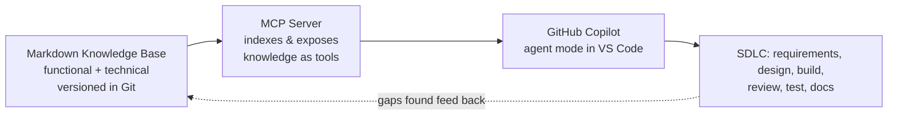

# Feeding the Machine

**Product knowledge as Markdown → MCP → GitHub Copilot — and how to make it work on legacy products at enterprise scale.**

This is the session material for developers and the scrum team. It explains how GenAI models actually work, what context they need to do real work, how to capture our product knowledge as Markdown, how to expose that knowledge to GitHub Copilot through MCP, and the failure modes that specifically bite large teams maintaining systems built up over many years.

The material is itself a small Markdown knowledge base — which is the point. This is the format we are proposing for our product knowledge: human-readable, version-controlled, diff-able, and natively consumable by AI tools.

## The core thesis

> Stop trying to make the model smarter. Start making its context **complete, current, and ours.**

Copilot is a brilliant generalist that knows nothing specific about our products. On a system layered up over 10–20 years, that gap is where the cost lives — confident-but-wrong code, invented APIs, ignored conventions. The fix is not a cleverer prompt. It is a deliberately engineered flow of knowledge into the model.

**Write knowledge once → serve it everywhere → every agent, every repo, every developer stays in sync.**

## How this knowledge base is organised

| File | What it covers |
|------|----------------|
| [`01-how-genai-models-work.md`](01-how-genai-models-work.md) | The model as a function, the context window, prompt vs context engineering, the five context types, and the Research → Plan → Implement loop. |
| [`02-capturing-knowledge-as-markdown.md`](02-capturing-knowledge-as-markdown.md) | Why Markdown, what knowledge to capture (functional + technical), and the anatomy of a good knowledge file. |
| [`03-mcp-and-github-copilot.md`](03-mcp-and-github-copilot.md) | What MCP is, the docs → MCP → Copilot architecture, and where it plugs into each SDLC phase. |
| [`04-legacy-scale-governance.md`](04-legacy-scale-governance.md) | The hard part: failure modes for legacy/large teams, the governance guardrails, the team operating model, and a pragmatic rollout. |
| [`knowledge-file-template.md`](knowledge-file-template.md) | A copy-paste starter template for a single knowledge file. |

## Running the session (suggested ~60–75 min)

1. **Frame the problem (5 min)** — README + why the gap hurts us specifically.
2. **How the model works (15 min)** — file 01. This is the intuition that makes the rest land.
3. **Capture as Markdown (15 min)** — file 02 + walk the template live.
4. **MCP & Copilot (15 min)** — file 03; show the architecture and one SDLC phase concretely.
5. **Legacy at scale & governance (15 min)** — file 04; be honest about the risks.
6. **Working session (10 min)** — pick the pilot product and the first 5 files to write.

> **Presenter note:** before presenting, swap in one or two real product names on the taxonomy and SDLC examples, and confirm with platform/security that MCP can be enabled — enterprise MCP is **disabled by default** and must be approved (covered in file 04).
