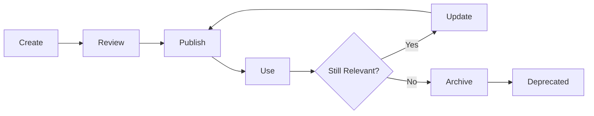

# GitHub Copilot Knowledge Hub - Implementation Guide

## Phase 1: Foundation Setup (Week 1-2)

### Week 1: Repository & Infrastructure

#### Day 1-2: Repository Creation

**Tasks**:
1. Create GitHub repository: `[org-name]/copilot-knowledge-hub`
2. Set up branch protection rules
3. Configure access permissions
4. Initialize directory structure

**GitHub Setup**:
```bash
# Clone the repository
git clone https://github.com/[org-name]/copilot-knowledge-hub.git
cd copilot-knowledge-hub

# Create directory structure
mkdir -p 01-custom-development/{design-patterns,coding-guidelines,features,templates}
mkdir -p 02-application-configuration/{setup-guides,use-cases,configuration-examples,templates}
mkdir -p 03-functional-testing/{test-cases,test-execution,validation-methods,templates}
mkdir -p 04-test-automation/{frameworks,scripts,test-data,templates}
mkdir -p 05-architecture/{diagrams,decision-records,integration-patterns}
mkdir -p 06-processes/{workflows,best-practices,checklists}
mkdir -p 07-copilot-usage/{getting-started,prompt-engineering,use-cases,tips-tricks}
mkdir -p 08-training-materials/{presentations,video-scripts,exercises}
mkdir -p .github

# Create initial files
touch README.md CONTRIBUTING.md
touch .github/copilot-instructions.md

# Commit initial structure
git add .
git commit -m "Initial repository structure for Copilot Knowledge Hub"
git push origin main
```

**Branch Protection Rules**:
- Require pull request reviews (minimum 2)
- Require status checks to pass
- Require conversation resolution
- Include administrators in restrictions

#### Day 3-4: Core Documentation

**Create Root README.md**:
```markdown
# GitHub Copilot Knowledge Hub

## 🎯 Purpose
Centralized knowledge repository for maximizing GitHub Copilot effectiveness across our Scrum team. This hub serves as both a learning resource and a training ground for Copilot's AI models to generate better, context-aware suggestions.

## 📚 Documentation Structure

### [01-Custom Development](./01-custom-development/)
Custom code development on vendor application
- Design patterns and architecture
- Coding guidelines and standards
- Feature implementation guides
- Code templates and boilerplate

### [02-Application Configuration](./02-application-configuration/)
Vendor application configuration activities
- Setup and installation guides
- Configuration use cases
- Example configurations
- Troubleshooting guides

### [03-Functional Testing](./03-functional-testing/)
Manual and functional testing documentation
- Test case repository
- Execution procedures
- Validation methods
- Test templates

### [04-Test Automation](./04-test-automation/)
Automated testing frameworks and scripts
- Framework documentation
- Automation scripts
- Test data management
- CI/CD integration

### [05-Architecture](./05-architecture/)
System architecture and design decisions
- Architecture diagrams
- Decision records (ADRs)
- Integration patterns
- Technical specifications

### [06-Processes](./06-processes/)
Team processes and workflows
- Development workflows
- Best practices
- Quality checklists
- Team guidelines

### [07-Copilot Usage](./07-copilot-usage/)
GitHub Copilot specific guidance
- Getting started guides
- Prompt engineering tips
- Use case examples
- Advanced features

### [08-Training Materials](./08-training-materials/)
Training and enablement resources
- Presentation decks
- Tutorial scripts
- Hands-on exercises
- Assessment materials

## 🚀 Quick Start

### For New Team Members
1. Read [Getting Started with Copilot](./07-copilot-usage/getting-started/)
2. Review your [role-specific guide](./07-copilot-usage/use-cases/)
3. Complete [onboarding exercises](./08-training-materials/exercises/)

### For Contributors
1. Read [Contributing Guidelines](./CONTRIBUTING.md)
2. Choose appropriate [documentation template](./templates/)
3. Use GitHub Copilot to generate content
4. Submit pull request for review

## 🎓 Training Schedule

### Week 1: Foundation
- Copilot installation and setup
- Basic features and shortcuts
- First hands-on exercises

### Week 2: Role-Specific Training
- Developers: Code generation and testing
- QA: Test automation and documentation
- Configuration: Setup guides and templates

### Week 3: Advanced Usage
- Prompt engineering techniques
- Copilot Chat mastery
- Team patterns and practices

### Week 4: Integration & Metrics
- Daily workflow integration
- Measuring effectiveness
- Continuous improvement

## 📊 Success Metrics

| Metric | Baseline | Target | Current |
|--------|----------|--------|---------|
| Copilot Acceptance Rate | - | > 30% | TBD |
| Documentation Coverage | - | 80% | TBD |
| Team Training Completion | - | 100% | TBD |
| Knowledge Articles | 0 | 50+ | 0 |

## 🤝 Team Champions

### Copilot Champions
- **Development**: [Name] - [email]
- **QA**: [Name] - [email]
- **Configuration**: [Name] - [email]

### Support Channels
- Slack: #copilot-knowledge
- Office Hours: Fridays 2-3 PM
- Email: copilot-team@company.com

## 📝 Contributing

We welcome contributions from all team members! See [CONTRIBUTING.md](./CONTRIBUTING.md) for:
- How to add new documentation
- Documentation standards
- Review process
- Best practices

## 🔗 Useful Links

### Internal
- [Team Wiki](link)
- [Jira Board](link)
- [Confluence Space](link)

### External
- [GitHub Copilot Docs](https://docs.github.com/copilot)
- [Markdown Guide](https://www.markdownguide.org/)
- [Mermaid Diagrams](https://mermaid.js.org/)

## 📅 Last Updated
Updated monthly by the Copilot Champions team

## 📄 License
Internal use only - [Company Name] © 2025
```

**Create CONTRIBUTING.md**:
```markdown
# Contributing to Copilot Knowledge Hub

## 📋 Table of Contents
- [Getting Started](#getting-started)
- [Documentation Standards](#documentation-standards)
- [Using Templates](#using-templates)
- [Submission Process](#submission-process)
- [Review Guidelines](#review-guidelines)

## Getting Started

### Prerequisites
- GitHub account with repository access
- GitHub Copilot enabled in your IDE
- Basic Git knowledge
- Familiarity with Markdown

### Setup Steps
1. Clone the repository
2. Install GitHub Copilot extension
3. Review documentation templates
4. Identify content to contribute

## Documentation Standards

### Markdown Formatting

**Headers**:
- Use H1 (#) for document title only
- Use H2 (##) for main sections
- Use H3 (###) for subsections
- Maximum depth: H4 (####)

**Code Blocks**:
Always specify language for syntax highlighting:
```java
// Good
public class Example {
    // code
}
```

**Lists**:
- Use `-` for unordered lists
- Use `1.` for ordered lists
- Indent nested lists with 2 spaces

**Tables**:
Always include headers:
```markdown
| Column 1 | Column 2 |
|----------|----------|
| Data 1   | Data 2   |
```

**Links**:
- Use relative links for internal docs: `[Guide](../guide.md)`
- Use descriptive link text: `[Setup Guide](link)` not `[Click here](link)`

### Front Matter
Every document must include metadata:
```yaml
---
title: Document Title
category: Custom Development | Configuration | Testing | etc.
author: Your Name
date_created: YYYY-MM-DD
date_updated: YYYY-MM-DD
tags: [tag1, tag2, tag3]
related_docs: [link1, link2]
copilot_friendly: true
---
```

### Code Comments
Make code Copilot-friendly:
```java
// GitHub Copilot Context: This service handles customer authentication
// using JWT tokens with 24-hour expiration
@Service
public class AuthService {
    // Clear, descriptive comments help Copilot learn patterns
}
```

### Naming Conventions

**File Names**:
- Use kebab-case: `feature-authentication-guide.md`
- Be descriptive: `selenium-page-object-pattern.md`
- Include dates for versioned docs: `config-guide-2025-10.md`

**Directory Names**:
- Use lowercase with hyphens
- Keep it concise but clear
- Follow established patterns

## Using Templates

### Available Templates
1. **Custom Development** - For feature implementations
2. **Application Configuration** - For setup/config guides
3. **Functional Testing** - For test cases
4. **Test Automation** - For automation scripts
5. **Architecture Decision Record** - For technical decisions
6. **Process Workflow** - For team processes
7. **Copilot Usage Guide** - For Copilot tips

### Template Location
Find templates in repository root or use artifacts provided.

### How to Use Templates

**Step 1: Copy Template**
```bash
# Copy appropriate template
cp templates/custom-development-template.md 01-custom-development/features/my-feature.md
```

**Step 2: Fill Front Matter**
Replace all placeholder values in the metadata section.

**Step 3: Use Copilot to Generate Content**
- Start with clear section headers
- Write descriptive comments
- Let Copilot suggest completions
- Use Copilot Chat for complex sections

**Example**:
```markdown
## Implementation Guide

<!-- Ask Copilot: Generate step-by-step implementation guide -->
### Prerequisites
[Start typing and let Copilot complete]
```

**Step 4: Add Code Examples**
Include well-commented, working code:
```java
// GitHub Copilot: REST controller for customer management
@RestController
@RequestMapping("/api/customers")
public class CustomerController {
    // Let Copilot generate methods based on this pattern
}
```

**Step 5: Review and Refine**
- Ensure accuracy
- Check formatting
- Verify links
- Test code examples

## Submission Process

### 1. Create Feature Branch
```bash
git checkout -b docs/your-topic-name
```

**Branch Naming**:
- `docs/feature-name` - New documentation
- `docs/update-feature-name` - Updates to existing docs
- `docs/fix-typo-section` - Bug fixes

### 2. Make Changes
- Follow templates
- Use Copilot extensively
- Commit frequently

### 3. Commit Guidelines

**Format**:
```
[Category] Brief description

Detailed explanation of changes
- Specific change 1
- Specific change 2

Related: #issue-number
```

**Examples**:
```
[Dev] Add authentication implementation guide

- Added step-by-step JWT implementation
- Included code examples for Spring Security
- Added troubleshooting section

Related: #45

[Config] Update email server setup guide

- Updated SMTP configuration steps
- Added TLS/SSL examples
- Included validation procedures
```

### 4. Create Pull Request

**PR Template**:
```markdown
## Description
Brief summary of what documentation was added/updated

## Documentation Added
- [ ] Custom Development
- [ ] Application Configuration
- [ ] Functional Testing
- [ ] Test Automation
- [ ] Architecture
- [ ] Process
- [ ] Copilot Usage
- [ ] Training Materials

## Checklist
- [ ] Front matter completed
- [ ] All placeholders replaced
- [ ] Code examples tested
- [ ] Links verified
- [ ] Screenshots included (if applicable)
- [ ] Cross-references added
- [ ] Copilot-friendly comments added
- [ ] Spelling/grammar checked

## Related Issues
Fixes #issue-number

## Additional Context
Any additional information for reviewers
```

### 5. Address Review Feedback
- Respond to comments
- Make requested changes
- Push updates to same branch

### 6. Merge
Once approved, squash and merge to main.

## Review Guidelines

### For Reviewers

**What to Check**:
1. **Accuracy**: Content is correct and up-to-date
2. **Completeness**: All template sections filled
3. **Clarity**: Easy to understand and follow
4. **Examples**: Code examples work and are relevant
5. **Formatting**: Follows markdown standards
6. **Links**: All links work correctly
7. **Copilot-Friendly**: Good context for AI learning

**Review Checklist**:
```markdown
- [ ] Title and front matter complete
- [ ] Content is accurate
- [ ] Examples are tested
- [ ] Formatting is consistent
- [ ] Links are valid
- [ ] Code is well-commented
- [ ] Cross-references appropriate
- [ ] Spelling and grammar correct
- [ ] Adds value to knowledge hub
```

**Feedback Guidelines**:
- Be constructive and specific
- Suggest improvements, not just problems
- Approve if minor issues remain
- Request changes for significant issues

### Review Timeline
- Initial review: Within 2 business days
- Follow-up reviews: Within 1 business day
- Urgent docs: Same day

## Best Practices

### Content Quality

**DO**:
✅ Write clear, concise content
✅ Include practical examples
✅ Test all code snippets
✅ Add screenshots where helpful
✅ Cross-reference related docs
✅ Update changelog
✅ Use Copilot to generate boilerplate

**DON'T**:
❌ Copy external content without attribution
❌ Include sensitive information
❌ Leave placeholders unfilled
❌ Add broken links
❌ Skip testing code examples
❌ Ignore review feedback

### Using GitHub Copilot for Documentation

**Effective Prompts**:
```markdown
<!-- Copilot: Generate installation steps for Spring Boot application -->

<!-- Copilot: Create test data examples for customer scenarios -->

<!-- Copilot: Write troubleshooting guide for common database errors -->
```

**Copilot Chat**:
```
"Generate a configuration checklist for email server setup"
"Create test scenarios for user authentication"
"Write API documentation for this endpoint"
"Explain this code in simple terms"
```

### Maintenance

**Regular Updates**:
- Review quarterly for accuracy
- Update outdated examples
- Refresh screenshots
- Archive deprecated content
- Update version references

**Document Lifecycle**:


## Getting Help

### Support Channels
- **Slack**: #copilot-knowledge
- **Email**: copilot-champions@company.com
- **Office Hours**: Fridays 2-3 PM

### Common Issues

**Issue**: Copilot not providing good suggestions
**Solution**: 
- Add more context in comments
- Review similar examples in repository
- Ask in #copilot-knowledge

**Issue**: Don't know which template to use
**Solution**: 
- Check category descriptions in README
- Ask Copilot Champions
- Start with closest match and adapt

**Issue**: Pull request stuck in review
**Solution**: 
- Ping reviewers in Slack
- Attend office hours
- Contact Copilot Champions

## Recognition

### Contributors
Top contributors are recognized:
- Monthly shout-outs in team meeting
- Featured in README
- Copilot Champion badges

### Metrics Tracked
- Number of documents contributed
- Quality of contributions
- Review participation
- Copilot usage demonstrations

## Examples of Good Contributions

### Example 1: Feature Documentation
- Complete, tested code examples
- Clear step-by-step instructions
- Troubleshooting section included
- Cross-referenced related docs

### Example 2: Configuration Guide
- Screenshots of each step
- Common issues documented
- Validation procedures included
- Alternative approaches noted

### Example 3: Test Automation
- Full working script
- Page object pattern used
- Test data examples provided
- CI/CD integration documented

## Changelog
| Date | Changes |
|------|---------|
| 2025-02-01 | Initial contributing guidelines |
| 2025-02-15 | Added Copilot-specific sections |
```

**Create .github/copilot-instructions.md**:
```markdown
# GitHub Copilot Custom Instructions

## Project Context
This is a knowledge hub for maximizing GitHub Copilot effectiveness across our Scrum team working on a vendor application with custom components.

## Code Style Preferences

### Java
- Use Java 17+ features
- Follow Google Java Style Guide
- Maximum method length: 50 lines
- Use meaningful variable names (full words, not abbreviations)
- Always include Javadoc for public methods

### Python
- Follow PEP 8
- Use type hints
- Maximum function length: 40 lines
- Use descriptive variable names

### JavaScript/TypeScript
- Use ES6+ features
- Follow Airbnb style guide
- Prefer const over let
- Use async/await over promises

## Documentation Patterns

### Comments
Always add context comments for Copilot:
```java
// GitHub Copilot Context: This method validates customer email addresses
// using RFC 5322 compliant regex pattern and checks for disposable domains
public boolean validateEmail(String email) {
    // implementation
}
```

### Test Naming
Use descriptive test names:
```java
@Test
void testCustomerCreation_WithValidData_ShouldReturnCreatedCustomer() {
    // Copilot understands what to test
}
```

## Architecture Patterns

### Preferred Patterns
- **Data Access**: Repository pattern
- **Business Logic**: Service layer pattern
- **API**: RESTful design with proper HTTP methods
- **Testing**: AAA pattern (Arrange-Act-Assert)
- **Error Handling**: Custom exceptions with meaningful messages

### Code Structure
```
src/
├── controller/     # REST controllers
├── service/        # Business logic
├── repository/     # Data access
├── model/          # Domain models
├── dto/            # Data transfer objects
├── exception/      # Custom exceptions
└── config/         # Configuration classes
```

## Testing Guidelines
- Minimum 80% code coverage
- Unit tests for all business logic
- Integration tests for API endpoints
- Use meaningful test data
- Mock external dependencies

## Security Considerations
- Always validate user input
- Sanitize data before database operations
- Use parameterized queries (no string concatenation)
- Implement proper authentication/authorization
- Never hardcode credentials

## Error Handling
```java
// Preferred error handling pattern
try {
    // operation
} catch (SpecificException e) {
    log.error("Context about what failed", e);
    throw new CustomBusinessException("User-friendly message", e);
}
```

## Naming Conventions

### Classes
- Controllers: `*Controller`
- Services: `*Service`
- Repositories: `*Repository`
- DTOs: `*DTO`
- Exceptions: `*Exception`

### Methods
- CRUD operations: `create`, `read`, `update`, `delete`
- Getters: `get*`
- Setters: `set*`
- Boolean methods: `is*`, `has*`, `can*`

## Performance Considerations
- Use pagination for large datasets
- Implement caching where appropriate
- Optimize database queries
- Use async operations for long-running tasks

## Common Patterns

### REST Controller
```java
@RestController
@RequestMapping("/api/v1/resource")
@Validated
public class ResourceController {
    
    private final ResourceService service;
    
    @GetMapping("/{id}")
    public ResponseEntity<ResourceDTO> get(@PathVariable Long id) {
        return ResponseEntity.ok(service.findById(id));
    }
}
```

### Service Layer
```java
@Service
@Transactional
public class ResourceService {
    
    private final ResourceRepository repository;
    
    public ResourceDTO findById(Long id) {
        return repository.findById(id)
            .map(this::toDTO)
            .orElseThrow(() -> new ResourceNotFoundException(id));
    }
}
```

### Repository
```java
@Repository
public interface ResourceRepository extends JpaRepository<Resource, Long> {
    Optional<Resource> findByName(String name);
}
```

## Specific to Our Project

### Vendor Application Integration
- Use vendor APIs through service layer
- Cache vendor responses when possible
- Implement retry logic for vendor calls
- Log all vendor interactions

### Custom Components
- Prefix custom classes with `Custom`
- Document integration points clearly
- Maintain separation from vendor code
- Version custom components independently

## Copilot Usage Tips
- Write clear comments describing intent
- Use descriptive variable/method names
- Provide examples in comments
- Break complex logic into smaller methods
- Review and test all Copilot suggestions
```

#### Day 5: Populate Initial Templates

**Tasks**:
1. Add all 7 templates to repository
2. Create example documentation for each category
3. Add initial team processes
4. Document current architecture

**Priority Documents**:
- Development workflow
- Code review process
- Testing procedures
- Deployment checklist
- Coding standards

### Week 2: Team Preparation

#### Day 1-2: Champion Training

**Copilot Champions Workshop**:
- Intensive 2-day training
- Advanced Copilot features
- Documentation best practices
- Teaching strategies
- Support procedures

**Champion Responsibilities**:
```markdown
# Copilot Champion Role

## Responsibilities
1. **Support**: Answer team questions about Copilot
2. **Training**: Conduct training sessions
3. **Content**: Create example documentation
4. **Advocacy**: Promote Copilot adoption
5. **Feedback**: Gather and relay team feedback

## Time Commitment
- 5 hours/week
- Office hours: 1 hour/week
- Training prep: 2 hours/week
- Support: 2 hours/week

## Support Structure
- Weekly champion sync meetings
- Dedicated Slack channel
- Monthly leadership updates
- Access to GitHub Copilot team
```

#### Day 3-4: Training Material Creation

**Deliverables**:
1. PowerPoint presentations (role-specific)
2. Hands-on exercise workbooks
3. Quick reference guides
4. Video tutorial scripts
5. Assessment quizzes

#### Day 5: Pilot Group Setup

**Select Pilot Team** (5-7 members):
- 2-3 Developers
- 2 QA Engineers
- 1 Configuration Specialist
- 1-2 Champions

**Pilot Objectives**:
- Test training materials
- Validate documentation process
- Identify gaps
- Gather feedback
- Create success stories

---

## Phase 2: Team Rollout (Week 3-6)

### Week 3: Wave 1 Training

#### Session 1: Introduction to GitHub Copilot (2 hours)

**Agenda**:
```markdown
# Session 1: GitHub Copilot Introduction

## 9:00-9:15 - Welcome & Overview
- Enterprise mandate context
- Benefits of Copilot
- Knowledge hub purpose
- Success metrics

## 9:15-9:45 - Copilot Basics
- What is GitHub Copilot
- How it works
- Privacy and security
- IDE integration

## 9:45-10:30 - Installation & Setup
### Hands-on Activity
- Install Copilot extension
- Configure settings
- First suggestions
- Basic shortcuts

## 10:30-10:45 - Break

## 10:45-11:30 - Daily Usage Patterns
- Code completion
- Comment-driven development
- Copilot Chat
- Common workflows

## 11:30-12:00 - Practice Exercises
### Exercise 1: Code Completion
Write a simple function with Copilot assistance

### Exercise 2: Test Generation
Generate unit tests for provided code

### Exercise 3: Documentation
Use Copilot to document a function

## Q&A and Wrap-up
```

**Materials Needed**:
- Presentation slides
- Exercise workbook
- Sample code repository
- Quick reference card

#### Session 2: Role-Specific Training (3 hours)

**For Developers**:
```markdown
# Developer Track

## Topics
1. Code generation patterns
2. Test-driven development with Copilot
3. Refactoring assistance
4. Documentation generation
5. Debugging with Copilot

## Hands-on Exercises
- Build a REST API with Copilot
- Generate comprehensive unit tests
- Refactor legacy code
- Create API documentation
```

**For QA Engineers**:
```markdown
# QA Track

## Topics
1. Test case generation
2. Test automation scripting
3. Test data creation
4. Documentation templates
5. Defect reporting

## Hands-on Exercises
- Write test cases with Copilot
- Create Selenium scripts
- Generate test data sets
- Document test execution
```

**For Configuration Specialists**:
```markdown
# Configuration Track

## Topics
1. Setup guide creation
2. Configuration documentation
3. Troubleshooting guides
4. Template generation
5. Knowledge sharing

## Hands-on Exercises
- Document configuration steps
- Create troubleshooting guide
- Generate configuration templates
- Build setup checklist
```

### Week 4: Wave 2 Training
Repeat training for remaining team members

### Week 5-6: Hands-on Practice Period

**Daily Activities**:
- Use Copilot for all tasks
- Document one item per week
- Attend office hours
- Share tips in Slack

**Support Structure**:
```markdown
# Support Schedule

## Office Hours
- Monday: 10:00-11:00 AM - Development topics
- Wednesday: 2:00-3:00 PM - Testing topics
- Friday: 3:00-4:00 PM - General Q&A

## Slack Channels
- #copilot-knowledge - General discussions
- #copilot-help - Technical support
- #copilot-wins - Success stories

## 1-on-1 Support
Champions available for individual sessions
```

---

## Phase 3: Measurement & Optimization (Week 7-8)

### Week 7: Metrics Collection

**Metrics to Track**:

**1. Adoption Metrics**:
```markdown
| Metric | Measurement Method | Target |
|--------|-------------------|--------|
| Active Users | IDE telemetry | 100% |
| Daily Usage | Suggestions per day | > 50 |
| Acceptance Rate | Accepted/Total suggestions | > 30% |
| Feature Usage | Chat, inline, workspace | All features |
```

**2. Productivity Metrics**:
```markdown
| Metric | Measurement Method | Target |
|--------|-------------------|--------|
| Code Velocity | Lines/week | +20% |
| Documentation | Docs created/week | 5 per person |
| Test Coverage | % coverage | +15% |
| Review Time | Hours for PR review | -25% |
```

**3. Quality Metrics**:
```markdown
| Metric | Measurement Method | Target |
|--------|-------------------|--------|
| Defect Rate | Bugs/feature | -10% |
| Code Quality | SonarQube score | Improved |
| Documentation Quality | Review scores | > 4/5 |
| Knowledge Completeness | Coverage % | 80% |
```

**4. Engagement Metrics**:
```markdown
| Metric | Measurement Method | Target |
|--------|-------------------|--------|
| Training Completion | % completed | 100% |
| Office Hours Attendance | Attendees/session | > 5 |
| Contributions | PRs submitted | 3 per person |
| Slack Activity | Messages/week | > 20 |
```

### Week 8: Analysis & Optimization

**Activities**:
1. Analyze collected metrics
2. Identify gaps and challenges
3. Gather team feedback
4. Plan improvements
5. Update training materials

**Feedback Collection**:
```markdown
# Copilot Adoption Survey

## Copilot Usage
1. How often do you use GitHub Copilot?
   - [ ] Daily
   - [ ] Few times per week
   - [ ] Rarely
   - [ ] Never

2. Which Copilot features do you use? (Select all)
   - [ ] Code completion
   - [ ] Copilot Chat
   - [ ] Test generation
   - [ ] Documentation
   - [ ] Refactoring

3. What is your Copilot suggestion acceptance rate?
   - [ ] < 10%
   - [ ] 10-30%
   - [ ] 30-50%
   - [ ] > 50%

## Knowledge Hub
4. Have you contributed to the knowledge hub?
   - [ ] Yes, multiple times
   - [ ] Yes, once
   - [ ] No, but planning to
   - [ ] No

5. How useful is the knowledge hub?
   - [ ] Very useful
   - [ ] Somewhat useful
   - [ ] Not very useful
   - [ ] Haven't used it

## Training
6. How effective was the training?
   - [ ] Excellent
   - [ ] Good
   - [ ] Fair
   - [ ] Poor

7. What additional training would help?
   [Open text]

## Challenges
8. What challenges have you faced with Copilot?
   [Open text]

9. What would improve your Copilot experience?
   [Open text]

## Overall
10. How has Copilot impacted your productivity?
    - [ ] Significantly increased
    - [ ] Moderately increased
    - [ ] No change
    - [ ] Decreased
```

---

## Phase 4: Continuous Improvement (Ongoing)

### Monthly Activities

**Week 1: Content Review**:
- Review documentation metrics
- Update outdated content
- Add new patterns discovered
- Archive deprecated information

**Week 2: Training Updates**:
- Refresh training materials
- Add new use cases
- Update examples
- Create advanced modules

**Week 3: Team Engagement**:
- Host lunch & learn sessions
- Share success stories
- Recognize top contributors
- Address challenges

**Week 4: Leadership Reporting**:
- Compile metrics dashboard
- Document ROI
- Highlight wins
- Present improvement plans

### Quarterly Reviews

**Activities**:
```markdown
# Quarterly Review Checklist

## Documentation Health
- [ ] All documents reviewed for accuracy
- [ ] Broken links fixed
- [ ] Screenshots updated
- [ ] Examples tested
- [ ] Metrics updated

## Team Performance
- [ ] Adoption metrics analyzed
- [ ] Productivity gains measured
- [ ] Quality improvements documented
- [ ] Team feedback collected

## Program Improvements
- [ ] Training materials updated
- [ ] New use cases added
- [ ] Process optimizations identified
- [ ] Success stories documented

## Strategic Planning
- [ ] Goals for next quarter set
- [ ] Resources allocated
- [ ] Challenges identified
- [ ] Solutions proposed
```

---

## Success Criteria

### Short-term (Month 1-2)
✅ Repository established with structure
✅ All templates created and documented
✅ 100% team training completion
✅ 50+ knowledge articles published
✅ Copilot installed and active for all

### Medium-term (Month 3-4)
✅ 30%+ Copilot acceptance rate
✅ 80% documentation coverage
✅ 3+ contributions per person
✅ Measurable productivity gains
✅ Positive team feedback

### Long-term (Month 5-6)
✅ Self-sustaining knowledge hub
✅ Continuous documentation growth
✅ Advanced Copilot adoption
✅ Demonstrated ROI
✅ Best practices established

---

## Risk Management

### Risk 1: Low Adoption
**Mitigation**:
- Make Copilot usage mandatory
- Track usage metrics
- Provide adequate support
- Address technical issues quickly
- Celebrate wins publicly

### Risk 2: Poor Documentation Quality
**Mitigation**:
- Strict review process
- Clear templates and examples
- Champion support available
- Regular quality audits
- Feedback loops

### Risk 3: Time Constraints
**Mitigation**:
- Allocate dedicated time
- Start with small contributions
- Use Copilot to speed up documentation
- Recognize contributions
- Leadership support

### Risk 4: Technical Issues
**Mitigation**:
- IT support engaged early
- Fallback plans prepared
- Champions trained on troubleshooting
- Clear escalation path
- Regular check-ins

---

## Budget & Resources

### One-Time Costs
- GitHub Copilot training: 4 days
- Champion workshop: 2 days
- Material creation: 1 week
- Repository setup: 3 days

### Ongoing Costs
- Champion time: 5 hours/week each
- Office hours: 3 hours/week
- Monthly reviews: 4 hours/month
- Quarterly planning: 1 day/quarter

### Required Resources
- GitHub Copilot licenses for all
- GitHub repository access
- Training room/virtual space
- Recording equipment (for videos)
- Communication tools (Slack)

---

## Next Steps

### Immediate Actions (This Week)
1. Get leadership approval
2. Provision GitHub repository
3. Select Copilot Champions
4. Schedule champion training
5. Create pilot group

### Week 1 Actions
1. Repository setup
2. Template creation
3. Champion training
4. Pilot kickoff
5. Communication plan

### Month 1 Goals
1. Complete team training
2. Publish 50+ documents
3. Achieve 80% Copilot activation
4. Establish support structure
5. Begin metrics collection

This implementation guide provides a comprehensive roadmap for successful GitHub Copilot adoption and knowledge hub establishment!