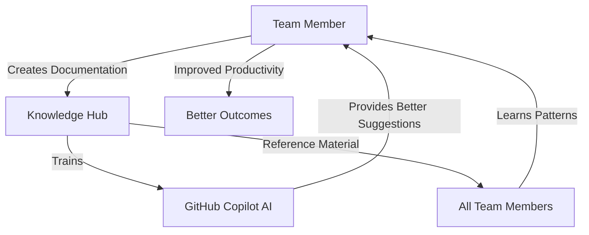

# GitHub Copilot Adoption & Knowledge Hub Strategy
## Leadership Presentation

---

## Executive Summary

### The Challenge
- Enterprise mandate requires regular GitHub Copilot usage
- Large Scrum team with diverse activities (development, configuration, testing)
- Need to maximize Copilot ROI while ensuring compliance
- Lack of centralized knowledge for Copilot effectiveness

### Our Solution
**Establish a GitHub Copilot Knowledge Hub** - A dual-purpose initiative that:
1. ✅ Ensures enterprise mandate compliance
2. 📚 Creates centralized knowledge repository
3. 🤖 Trains Copilot AI with our patterns and practices
4. 📈 Measurably improves team productivity

### Expected Outcomes
- **100% Copilot adoption** across team
- **20-30% productivity increase** in documentation and coding tasks
- **80% knowledge coverage** of team activities
- **Improved code quality** through consistent patterns
- **Faster onboarding** for new team members

---

## Current State Assessment

### Team Composition
```
Total Team Size: [X] members

Breakdown:
├── Custom Development: [Y] developers
├── Application Configuration: [Z] specialists  
├── Functional Testing: [A] QA engineers
├── Test Automation: [B] automation engineers
└── Other Roles: [C] members
```

### Activity Distribution
| Activity | Team % | Current Documentation | Copilot Usage |
|----------|--------|----------------------|---------------|
| Custom Development | 30% | Scattered | Low |
| App Configuration | 40% | Minimal | Very Low |
| Functional Testing | 20% | Basic | Low |
| Test Automation | 10% | Good | Medium |

### Pain Points
1. **Knowledge Silos** - Information trapped in individual minds
2. **Inconsistent Practices** - No standard patterns or approaches
3. **Slow Onboarding** - New members take weeks to ramp up
4. **Repetitive Work** - Same documentation created multiple times
5. **Low Copilot Usage** - Team doesn't know how to leverage effectively

---

## Enterprise Mandate Context

### Requirement
> "Regular use of GitHub Copilot across all activities. Non-compliance will negatively impact reporting."

### Compliance Challenges
- ❌ Most team members unfamiliar with Copilot
- ❌ Configuration and testing activities seem "incompatible" with coding tool
- ❌ No training or support structure
- ❌ No metrics to demonstrate usage
- ❌ Risk of poor compliance scores

### Our Approach
✅ **Comprehensive Training** - Role-specific education
✅ **Practical Applications** - Use cases for every activity type
✅ **Measurement Framework** - Track and report usage
✅ **Support Structure** - Champions and office hours
✅ **Knowledge Hub** - Make Copilot increasingly valuable over time

---

## Solution: GitHub Copilot Knowledge Hub

### What is it?
A **centralized GitHub repository** containing:
- 📝 All development and testing documentation
- 🎯 Best practices and coding standards
- 🔧 Configuration guides and procedures
- ✅ Test cases and automation scripts
- 🏗️ Architecture decisions and patterns
- 📊 Process workflows and checklists

### How it Works



### Dual Benefits

**Immediate Value**:
- Centralized knowledge repository
- Standardized practices
- Faster onboarding
- Better collaboration
- Mandate compliance

**Long-term Value**:
- Copilot learns our specific patterns
- AI suggestions become increasingly accurate
- Productivity compounds over time
- Self-documenting codebase
- Continuous improvement cycle

---

## Implementation Strategy

### Phase 1: Foundation (Week 1-2)
**Activities**:
- Create GitHub repository structure
- Develop documentation templates
- Train Copilot Champions (3-4 team members)
- Pilot with small group (5-7 members)

**Deliverables**:
- Repository with 7 categories
- 7 comprehensive templates
- Trained champion team
- Pilot success stories

### Phase 2: Team Rollout (Week 3-6)
**Activities**:
- Wave 1 training (50% of team)
- Wave 2 training (remaining 50%)
- Begin documentation contributions
- Establish support structure

**Deliverables**:
- 100% team trained
- 50+ knowledge articles published
- Active office hours
- Support channels operational

### Phase 3: Measurement (Week 7-8)
**Activities**:
- Collect usage metrics
- Gather team feedback
- Analyze productivity gains
- Optimize processes

**Deliverables**:
- Metrics dashboard
- Feedback analysis
- Improvement plan
- Success metrics

### Phase 4: Continuous Improvement (Ongoing)
**Activities