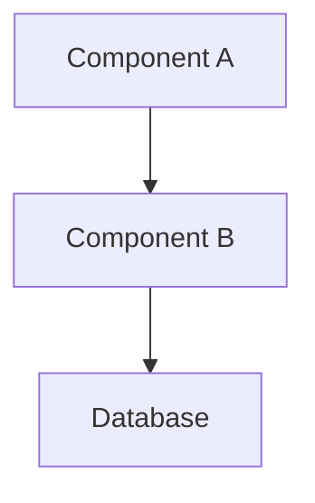
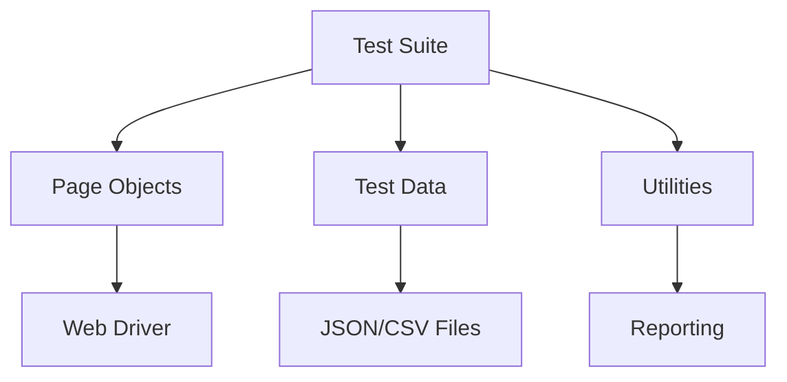
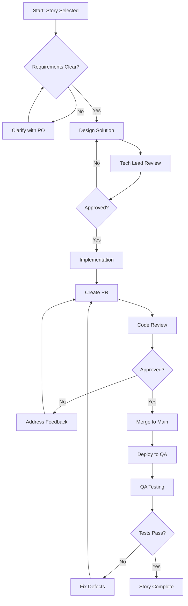
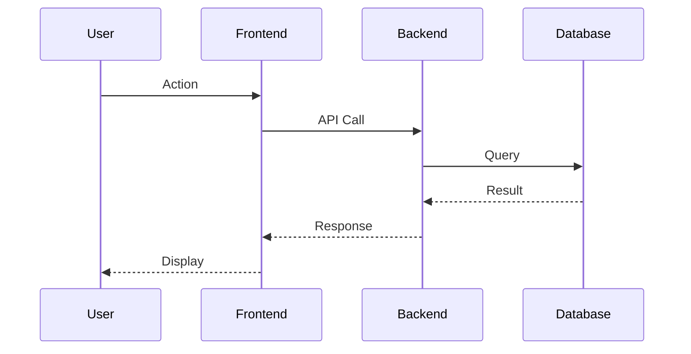

# Documentation Templates for GitHub Copilot Knowledge Hub

## Template 1: Custom Feature Development

```markdown
---
title: [Feature Name]
category: Custom Development
author: [Your Name]
date_created: YYYY-MM-DD
date_updated: YYYY-MM-DD
tags: [feature, backend, frontend, api]
related_docs: [link1, link2]
copilot_friendly: true
---

# [Feature Name]

## Overview
Brief description of the feature and its business value.

## Business Requirements
- Requirement 1
- Requirement 2
- Requirement 3

## Technical Design

### Architecture


### Components Involved
| Component | Responsibility | Technology |
|-----------|---------------|------------|
| Frontend | UI/UX | React/Angular |
| Backend | Business Logic | Java/Python |
| Database | Data Persistence | PostgreSQL |

### Data Flow
1. Step 1: User action triggers...
2. Step 2: Backend processes...
3. Step 3: Response returned...

## Implementation Guide

### Prerequisites
- Required libraries/dependencies
- Environment setup
- Access permissions needed

### Code Structure
```
feature-name/
├── controller/
├── service/
├── repository/
└── model/
```

### Key Code Snippets

#### Controller Example
```java
// GitHub Copilot Context: RESTful API endpoint for [feature]
@RestController
@RequestMapping("/api/v1/feature")
public class FeatureController {
    
    @Autowired
    private FeatureService featureService;
    
    @GetMapping("/{id}")
    public ResponseEntity<FeatureDTO> getFeature(@PathVariable Long id) {
        // Implementation details
        return ResponseEntity.ok(featureService.getFeatureById(id));
    }
}
```

#### Service Layer
```java
// GitHub Copilot Context: Business logic for [feature]
@Service
public class FeatureService {
    
    @Autowired
    private FeatureRepository repository;
    
    public FeatureDTO getFeatureById(Long id) {
        // Add validation, error handling, and business rules
        return repository.findById(id)
            .map(this::convertToDTO)
            .orElseThrow(() -> new FeatureNotFoundException(id));
    }
}
```

## Testing Strategy

### Unit Tests
```java
// GitHub Copilot Context: Unit test for FeatureService
@Test
void testGetFeatureById_Success() {
    // Arrange
    Long featureId = 1L;
    Feature mockFeature = createMockFeature(featureId);
    
    // Act
    FeatureDTO result = featureService.getFeatureById(featureId);
    
    // Assert
    assertEquals(featureId, result.getId());
}
```

### Integration Tests
- Test scenario 1
- Test scenario 2

## Configuration

### Application Properties
```properties
# Feature-specific configurations
feature.enabled=true
feature.max-connections=100
```

### Environment Variables
- `FEATURE_API_KEY`: API key for external service
- `FEATURE_TIMEOUT`: Request timeout in milliseconds

## Deployment Notes
- Pre-deployment checklist
- Database migration scripts
- Rollback procedure

## Known Issues & Limitations
- Issue 1: Description and workaround
- Issue 2: Description and workaround

## References
- [Related Documentation](link)
- [API Specification](link)
- [Design Document](link)

## Changelog
| Date | Author | Changes |
|------|--------|---------|
| 2025-01-15 | John Doe | Initial version |
| 2025-02-01 | Jane Smith | Added error handling |
```

---

## Template 2: Application Configuration

```markdown
---
title: [Configuration Use Case Name]
category: Application Configuration
author: [Your Name]
date_created: YYYY-MM-DD
date_updated: YYYY-MM-DD
tags: [configuration, setup, vendor-app]
related_docs: [link1, link2]
copilot_friendly: true
---

# [Configuration Use Case Name]

## Purpose
What business problem does this configuration solve?

## Prerequisites
- Required modules/licenses
- User permissions needed
- Dependent configurations

## Configuration Steps

### Step 1: [Step Name]
**Navigation**: Path > To > Configuration > Screen

**Actions**:
1. Click on [Button Name]
2. Enter the following values:
   - Field 1: `value1`
   - Field 2: `value2`
3. Click Save

**Screenshot Reference**: `images/config-step1.png`

**Copilot Tip**: When configuring similar fields, use pattern: `field-name: value`

### Step 2: [Step Name]
**Navigation**: Path > To > Next > Screen

**Configuration Values**:
```json
{
  "parameter1": "value1",
  "parameter2": "value2",
  "nestedConfig": {
    "subParam1": "subValue1"
  }
}
```

### Step 3: Validation
**How to verify**:
1. Navigate to validation screen
2. Check for expected values
3. Test the functionality

**Expected Result**:
- System behaves as described
- No error messages
- Data saved correctly

## Configuration Reference

### Key Settings
| Setting | Value | Purpose |
|---------|-------|---------|
| Setting1 | Value1 | Explanation |
| Setting2 | Value2 | Explanation |

### Business Rules
- Rule 1: When X happens, system does Y
- Rule 2: Field A is required when B is selected

## Common Issues & Troubleshooting

### Issue 1: [Error Message]
**Cause**: Description of cause
**Solution**: Step-by-step resolution
```bash
# Commands to resolve if applicable
command --flag value
```

### Issue 2: [Unexpected Behavior]
**Symptom**: What users see
**Root Cause**: Why it happens
**Fix**: How to correct it

## Testing Checklist
- [ ] Configuration saved successfully
- [ ] Validation rules work as expected
- [ ] Integration with other modules tested
- [ ] User permissions verified
- [ ] Documentation updated

## Related Configurations
- [Configuration A](link): Brief description
- [Configuration B](link): Brief description

## Impact Analysis
- **Affected Modules**: List of modules impacted
- **Affected Users**: User groups affected
- **Performance Considerations**: Any performance implications

## Rollback Procedure
In case configuration needs to be reverted:
1. Step 1
2. Step 2
3. Step 3

## References
- Vendor Documentation: [link]
- Internal Wiki: [link]
- Support Ticket: [ticket-number]

## Changelog
| Date | Author | Changes |
|------|--------|---------|
| 2025-01-20 | Config Team | Initial setup |
```

---

## Template 3: Functional Testing

```markdown
---
title: [Test Case ID] - [Test Case Name]
category: Functional Testing
author: [Your Name]
date_created: YYYY-MM-DD
date_updated: YYYY-MM-DD
tags: [testing, functional, module-name]
test_priority: High/Medium/Low
test_type: Positive/Negative/Boundary
related_docs: [requirement-doc, feature-doc]
copilot_friendly: true
---

# Test Case: [Test Case Name]

## Test Case Information
- **Test Case ID**: TC-001
- **Module**: [Module Name]
- **Feature**: [Feature Name]
- **Priority**: High/Medium/Low
- **Test Type**: Functional/Integration/Regression
- **Automation Status**: Manual/Automated/Planned

## Objective
What is this test validating?

## Preconditions
- User has [specific role/permission]
- System is in [specific state]
- Test data is prepared
- Required configurations are in place

## Test Data
```yaml
user:
  username: testuser001
  role: Admin
  
test_record:
  id: 12345
  status: Active
  value: 1000
```

## Test Steps

| Step | Action | Expected Result | Actual Result | Status |
|------|--------|-----------------|---------------|--------|
| 1 | Navigate to [Screen Name] | Screen loads successfully | | |
| 2 | Enter value in [Field Name]: `test_value` | Field accepts input | | |
| 3 | Click [Button Name] | Confirmation message displayed | | |
| 4 | Verify [Expected Outcome] | Data saved correctly | | |

## Detailed Step Instructions

### Step 1: Navigation
```
1. Login as: testuser001
2. Click Menu > Module > Screen
3. Wait for page load
```

### Step 2: Data Entry
```
Field Mapping:
- Customer Name: "ABC Corporation"
- Amount: 1000.00
- Date: Current Date
- Status: "Active"
```

### Step 3: Submission
```
1. Click "Submit" button
2. Wait for processing (max 5 seconds)
3. Observe confirmation message
```

### Step 4: Verification
```
Validation Points:
- Record appears in list view
- Status shows as "Active"
- Audit log entry created
- Email notification sent (if applicable)
```

## Expected Results
Comprehensive description of what should happen when test passes.

## Actual Results
[To be filled during execution]

## Test Evidence
- Screenshot 1: Initial state
- Screenshot 2: After action
- Screenshot 3: Final result
- Log files: `evidence/TC-001-logs.txt`

## Validation Queries
```sql
-- GitHub Copilot Context: Validation query for test case TC-001
SELECT id, status, created_date 
FROM customer_records 
WHERE customer_name = 'ABC Corporation'
AND created_date >= CURRENT_DATE;
```

## Negative Test Scenarios

### Scenario 1: Invalid Input
**Action**: Enter invalid value in [Field]
**Expected**: Validation error displayed
**Error Message**: "[Expected error text]"

### Scenario 2: Missing Required Field
**Action**: Leave [Field] empty
**Expected**: Form submission prevented
**Error Message**: "[Expected error text]"

## Boundary Conditions
- Minimum value: [value]
- Maximum value: [value]
- Special characters: Test with @, #, $, etc.
- Length limits: Test with min/max length strings

## Dependencies
- **Depends On**: [TC-XXX] must pass first
- **Blocked By**: Known issue [BUG-XXX]
- **Related Tests**: [TC-YYY], [TC-ZZZ]

## Test Environment
- **Environment**: QA/Staging/Production
- **Browser**: Chrome 120+ / Firefox 115+
- **OS**: Windows 10/11, macOS
- **Test Data Set**: Dataset-001

## Execution History
| Date | Tester | Result | Build | Notes |
|------|--------|--------|-------|-------|
| 2025-02-01 | John Doe | Pass | v2.1.0 | All steps passed |
| 2025-02-15 | Jane Smith | Fail | v2.1.1 | Step 3 failed - Bug logged |

## Defects Found
- [BUG-001](link): Description
- [BUG-002](link): Description

## Automation Notes
```python
# GitHub Copilot Context: Automation script for TC-001
def test_customer_creation():
    """
    Automated test for customer record creation
    """
    # Navigate to page
    driver.get("https://app.example.com/customers")
    
    # Enter test data
    driver.find_element(By.ID, "customerName").send_keys("ABC Corporation")
    driver.find_element(By.ID, "amount").send_keys("1000.00")
    
    # Submit form
    driver.find_element(By.ID, "submitBtn").click()
    
    # Verify result
    assert "Success" in driver.find_element(By.ID, "message").text
```

## References
- Requirements: [REQ-001](link)
- User Story: [US-123](link)
- Design Document: [link]

## Changelog
| Date | Author | Changes |
|------|--------|---------|
| 2025-01-25 | QA Team | Test case created |
| 2025-02-05 | QA Team | Added negative scenarios |
```

---

## Template 4: Test Automation

```markdown
---
title: [Automation Script Name]
category: Test Automation
author: [Your Name]
date_created: YYYY-MM-DD
date_updated: YYYY-MM-DD
tags: [automation, selenium, api, framework-name]
framework: Selenium/RestAssured/Playwright
language: Java/Python/JavaScript
related_docs: [test-case-doc, framework-doc]
copilot_friendly: true
---

# Automation Script: [Script Name]

## Overview
Purpose and scope of this automation script.

## Test Coverage
- Feature: [Feature Name]
- Test Cases Covered: TC-001, TC-002, TC-003
- Test Type: UI/API/Integration/E2E

## Prerequisites

### Environment Setup
```bash
# Install dependencies
pip install selenium pytest
npm install playwright @playwright/test

# Set environment variables
export TEST_URL=https://qa.example.com
export TEST_USER=automation_user
export TEST_PASS=secure_password
```

### Test Data Requirements
- Test user accounts
- Sample data files
- API credentials
- Database access

## Framework Architecture



## Script Structure

### File Organization
```
automation-project/
├── tests/
│   ├── test_customer_creation.py
│   └── test_order_processing.py
├── pages/
│   ├── login_page.py
│   └── customer_page.py
├── data/
│   └── test_data.json
├── utils/
│   ├── driver_factory.py
│   └── reporting.py
└── config/
    └── config.yaml
```

## Complete Script Code

### Main Test Script
```python
# GitHub Copilot Context: Selenium test automation for customer creation
import pytest
from selenium import webdriver
from selenium.webdriver.common.by import By
from selenium.webdriver.support.ui import WebDriverWait
from selenium.webdriver.support import expected_conditions as EC
from pages.login_page import LoginPage
from pages.customer_page import CustomerPage
from utils.test_data import TestData

class TestCustomerCreation:
    """
    Test suite for customer creation functionality
    """
    
    @pytest.fixture(scope="function")
    def setup(self):
        """Setup test environment before each test"""
        self.driver = webdriver.Chrome()
        self.driver.maximize_window()
        self.driver.get("https://qa.example.com")
        yield
        self.driver.quit()
    
    def test_create_new_customer_success(self, setup):
        """
        Test Case: TC-001 - Create new customer with valid data
        """
        # Arrange
        test_data = TestData.get_customer_data("valid_customer")
        login_page = LoginPage(self.driver)
        customer_page = CustomerPage(self.driver)
        
        # Act - Login
        login_page.login("automation_user", "password123")
        
        # Act - Navigate to customer creation
        customer_page.navigate_to_create_customer()
        
        # Act - Fill customer details
        customer_page.enter_customer_name(test_data['name'])
        customer_page.enter_customer_email(test_data['email'])
        customer_page.select_customer_type(test_data['type'])
        customer_page.click_submit()
        
        # Assert
        success_message = customer_page.get_success_message()
        assert "Customer created successfully" in success_message
        
        # Verify in database
        customer_id = customer_page.get_created_customer_id()
        assert self.verify_customer_in_db(customer_id)
    
    def test_create_customer_validation_errors(self, setup):
        """
        Test Case: TC-002 - Validation errors for invalid data
        """
        login_page = LoginPage(self.driver)
        customer_page = CustomerPage(self.driver)
        
        login_page.login("automation_user", "password123")
        customer_page.navigate_to_create_customer()
        
        # Test with empty name
        customer_page.enter_customer_name("")
        customer_page.click_submit()
        
        error_message = customer_page.get_error_message()
        assert "Customer name is required" in error_message
    
    def verify_customer_in_db(self, customer_id):
        """Helper method to verify customer in database"""
        # Database verification logic
        return True
```

### Page Object Model

```python
# GitHub Copilot Context: Page Object for customer management page
from selenium.webdriver.common.by import By
from selenium.webdriver.support.ui import WebDriverWait
from selenium.webdriver.support import expected_conditions as EC

class CustomerPage:
    """Page Object for Customer Management page"""
    
    # Locators
    CREATE_CUSTOMER_BTN = (By.ID, "createCustomerBtn")
    CUSTOMER_NAME_INPUT = (By.ID, "customerName")
    CUSTOMER_EMAIL_INPUT = (By.ID, "customerEmail")
    CUSTOMER_TYPE_SELECT = (By.ID, "customerType")
    SUBMIT_BTN = (By.ID, "submitBtn")
    SUCCESS_MESSAGE = (By.CLASS_NAME, "success-message")
    ERROR_MESSAGE = (By.CLASS_NAME, "error-message")
    
    def __init__(self, driver):
        self.driver = driver
        self.wait = WebDriverWait(driver, 10)
    
    def navigate_to_create_customer(self):
        """Navigate to customer creation form"""
        create_btn = self.wait.until(
            EC.element_to_be_clickable(self.CREATE_CUSTOMER_BTN)
        )
        create_btn.click()
    
    def enter_customer_name(self, name):
        """Enter customer name"""
        name_input = self.wait.until(
            EC.presence_of_element_located(self.CUSTOMER_NAME_INPUT)
        )
        name_input.clear()
        name_input.send_keys(name)
    
    def enter_customer_email(self, email):
        """Enter customer email"""
        email_input = self.driver.find_element(*self.CUSTOMER_EMAIL_INPUT)
        email_input.clear()
        email_input.send_keys(email)
    
    def select_customer_type(self, customer_type):
        """Select customer type from dropdown"""
        from selenium.webdriver.support.ui import Select
        select = Select(self.driver.find_element(*self.CUSTOMER_TYPE_SELECT))
        select.select_by_visible_text(customer_type)
    
    def click_submit(self):
        """Click submit button"""
        submit_btn = self.driver.find_element(*self.SUBMIT_BTN)
        submit_btn.click()
    
    def get_success_message(self):
        """Get success message text"""
        message = self.wait.until(
            EC.presence_of_element_located(self.SUCCESS_MESSAGE)
        )
        return message.text
    
    def get_error_message(self):
        """Get error message text"""
        message = self.wait.until(
            EC.presence_of_element_located(self.ERROR_MESSAGE)
        )
        return message.text
    
    def get_created_customer_id(self):
        """Extract customer ID from success message"""
        message = self.get_success_message()
        # Parse customer ID from message
        return message.split("ID: ")[1]
```

### Test Data Management

```python
# GitHub Copilot Context: Test data management utility
import json

class TestData:
    """Manage test data for automation scripts"""
    
    @staticmethod
    def get_customer_data(data_key):
        """Load customer test data"""
        with open('data/customer_data.json', 'r') as f:
            data = json.load(f)
        return data.get(data_key, {})
    
    @staticmethod
    def generate_unique_email():
        """Generate unique email for testing"""
        import time
        timestamp = int(time.time())
        return f"test_{timestamp}@example.com"
```

### Configuration

```yaml
# config.yaml
# GitHub Copilot Context: Test automation configuration
environments:
  qa:
    url: https://qa.example.com
    database:
      host: qa-db.example.com
      port: 5432
  staging:
    url: https://staging.example.com
    database:
      host: staging-db.example.com
      port: 5432

selenium:
  browser: chrome
  headless: false
  implicit_wait: 10
  page_load_timeout: 30

reporting:
  output_dir: ./reports
  screenshot_on_failure: true
  video_recording: false
```

## Execution Instructions

### Run All Tests
```bash
# Run with pytest
pytest tests/ -v --html=reports/report.html

# Run specific test
pytest tests/test_customer_creation.py::TestCustomerCreation::test_create_new_customer_success

# Run with markers
pytest -m smoke -v
pytest -m regression -v
```

### CI/CD Integration
```yaml
# .github/workflows/automation.yml
name: Automation Tests

on:
  push:
    branches: [ main, develop ]
  schedule:
    - cron: '0 2 * * *'  # Run daily at 2 AM

jobs:
  test:
    runs-on: ubuntu-latest
    steps:
      - uses: actions/checkout@v2
      - name: Set up Python
        uses: actions/setup-python@v2
        with:
          python-version: '3.9'
      - name: Install dependencies
        run: |
          pip install -r requirements.txt
      - name: Run tests
        run: |
          pytest tests/ -v --html=reports/report.html
      - name: Upload report
        uses: actions/upload-artifact@v2
        with:
          name: test-report
          path: reports/
```

## Reporting

### Test Results Format
```
============================== test session starts ===============================
tests/test_customer_creation.py::TestCustomerCreation::test_create_new_customer_success PASSED
tests/test_customer_creation.py::TestCustomerCreation::test_create_customer_validation_errors PASSED

============================== 2 passed in 15.23s ================================
```

### Failure Handling
- Screenshots captured on failure
- Detailed error logs
- Stack trace included
- Video recording (if enabled)

## Maintenance

### Best Practices
- Keep page objects updated with UI changes
- Use explicit waits instead of implicit waits
- Implement retry logic for flaky tests
- Regular cleanup of test data
- Update selectors when application changes

### Common Issues

#### Issue 1: Element Not Found
```python
# Use better wait strategies
from selenium.webdriver.support.ui import WebDriverWait
from selenium.webdriver.support import expected_conditions as EC

element = WebDriverWait(driver, 10).until(
    EC.presence_of_element_located((By.ID, "elementId"))
)
```

#### Issue 2: Stale Element Reference
```python
# Refetch element before interaction
def click_element_safely(driver, locator):
    max_attempts = 3
    for attempt in range(max_attempts):
        try:
            element = driver.find_element(*locator)
            element.click()
            break
        except StaleElementReferenceException:
            if attempt == max_attempts - 1:
                raise
```

## Performance Optimization
- Use parallel execution: `pytest -n 4`
- Implement smart waits
- Minimize browser interactions
- Reuse browser sessions where appropriate
- Use headless mode for CI/CD

## References
- Framework Documentation: [link]
- Selenium Documentation: https://selenium.dev
- pytest Documentation: https://pytest.org

## Changelog
| Date | Author | Changes |
|------|--------|---------|
| 2025-02-01 | Automation Team | Initial script |
| 2025-02-10 | Automation Team | Added POM pattern |
```

---

## Usage Guidelines

### How to Use These Templates

1. **Copy the appropriate template** for your documentation need
2. **Replace placeholders** (text in square brackets) with actual content
3. **Use GitHub Copilot** to help fill in sections:
   - Start typing and let Copilot suggest completions
   - Use comments to guide Copilot: `<!-- Copilot: Add error handling code -->`
   - Ask Copilot Chat to generate specific sections
4. **Add code examples** that are well-commented for future Copilot learning
5. **Keep consistent formatting** across all documents
6. **Cross-reference related documents** using relative links
7. **Update changelog** whenever you make changes

### Copilot Tips for Each Template

#### For Custom Development Template:
- Use Copilot to generate boilerplate code
- Ask: "Generate a REST controller for customer management"
- Use inline comments to describe business logic
- Copilot learns from well-documented code patterns

#### For Application Configuration Template:
- Use Copilot to format JSON/YAML configurations
- Ask: "Convert these configuration steps to JSON format"
- Document configuration patterns consistently
- Include validation rules in comments

#### For Functional Testing Template:
- Use Copilot to generate test data
- Ask: "Generate test data for customer scenarios"
- Create reusable test step patterns
- Document validation queries clearly

#### For Test Automation Template:
- Use Copilot to generate test methods
- Ask: "Generate pytest test cases for login functionality"
- Let Copilot suggest page object methods
- Use descriptive method names for better suggestions

---

## Template 5: Architecture Decision Record (ADR)

```markdown
---
title: ADR-[Number]: [Decision Title]
category: Architecture
status: Proposed/Accepted/Deprecated/Superseded
date_created: YYYY-MM-DD
decision_makers: [Name1, Name2]
tags: [architecture, decision, technology]
related_adrs: [ADR-001, ADR-002]
copilot_friendly: true
---

# ADR-[Number]: [Decision Title]

## Status
**Current Status**: Proposed | Accepted | Deprecated | Superseded

**Date**: YYYY-MM-DD

**Supersedes**: [ADR-XXX] (if applicable)

**Superseded By**: [ADR-YYY] (if applicable)

## Context
What is the issue we're trying to address? What factors are at play?

### Background
- Current situation description
- Business drivers
- Technical constraints
- Timeline considerations

### Problem Statement
Clear description of the problem or decision that needs to be made.

## Decision Drivers
- **Performance Requirements**: Response time < 2 seconds
- **Scalability**: Must support 10,000 concurrent users
- **Cost**: Budget constraints
- **Team Skills**: Current team expertise
- **Time to Market**: Delivery deadline
- **Maintainability**: Long-term support requirements

## Options Considered

### Option 1: [Option Name]

**Description**: Detailed description of this approach

**Pros**:
- Advantage 1
- Advantage 2
- Advantage 3

**Cons**:
- Disadvantage 1
- Disadvantage 2
- Disadvantage 3

**Cost Analysis**:
- Initial: $X
- Ongoing: $Y/month
- Training: Z hours

**Implementation Effort**: X weeks

**Technical Details**:
```java
// GitHub Copilot Context: Example implementation of Option 1
public class Option1Implementation {
    // Code example showing key aspects
}
```

### Option 2: [Option Name]

**Description**: Detailed description of this approach

**Pros**:
- Advantage 1
- Advantage 2

**Cons**:
- Disadvantage 1
- Disadvantage 2

**Cost Analysis**:
- Initial: $X
- Ongoing: $Y/month

**Implementation Effort**: X weeks

### Option 3: [Option Name]
[Similar structure as above]

## Decision Comparison Matrix

| Criteria | Weight | Option 1 | Option 2 | Option 3 |
|----------|--------|----------|----------|----------|
| Performance | 25% | 8/10 | 6/10 | 9/10 |
| Cost | 20% | 6/10 | 9/10 | 5/10 |
| Maintainability | 20% | 7/10 | 8/10 | 6/10 |
| Team Expertise | 15% | 9/10 | 7/10 | 5/10 |
| Scalability | 20% | 7/10 | 6/10 | 9/10 |
| **Total** | **100%** | **7.4** | **7.2** | **7.1** |

## Decision
We will choose **Option 1: [Option Name]**

### Rationale
Detailed explanation of why this option was chosen over the alternatives.

Key factors:
1. Factor 1 explanation
2. Factor 2 explanation
3. Factor 3 explanation

### Expected Outcomes
- Outcome 1
- Outcome 2
- Outcome 3

## Implementation Plan

### Phase 1: Preparation (Week 1-2)
- [ ] Task 1
- [ ] Task 2
- [ ] Task 3

### Phase 2: Development (Week 3-6)
- [ ] Task 1
- [ ] Task 2

### Phase 3: Testing & Deployment (Week 7-8)
- [ ] Task 1
- [ ] Task 2

## Consequences

### Positive Consequences
- Benefit 1
- Benefit 2
- Benefit 3

### Negative Consequences
- Trade-off 1 and mitigation strategy
- Trade-off 2 and mitigation strategy

### Risks
| Risk | Impact | Probability | Mitigation |
|------|--------|-------------|------------|
| Risk 1 | High | Medium | Mitigation plan |
| Risk 2 | Medium | Low | Mitigation plan |

## Validation Criteria
How will we know if this decision was successful?

- **Performance Metrics**: Response time < 2s
- **Adoption Metrics**: 80% team adoption in 3 months
- **Quality Metrics**: Defect rate < 2%
- **Business Metrics**: Cost savings of $X/year

## Review Date
This decision will be reviewed on: YYYY-MM-DD

## References
- [Technical Specification](link)
- [Vendor Documentation](link)
- [Research Article](link)
- [Proof of Concept](link)

## Changelog
| Date | Author | Changes |
|------|--------|---------|
| 2025-02-01 | Architecture Team | Proposed |
| 2025-02-15 | Architecture Team | Accepted |
```

---

## Template 6: Process Workflow Documentation

```markdown
---
title: [Workflow Name] Process
category: Process Documentation
author: [Your Name]
date_created: YYYY-MM-DD
date_updated: YYYY-MM-DD
tags: [process, workflow, team-practice]
related_docs: [link1, link2]
copilot_friendly: true
---

# [Workflow Name] Process

## Overview
Brief description of the workflow and its purpose.

## Scope
- **Applies To**: Development Team, QA Team, etc.
- **Frequency**: Daily, Weekly, Per Sprint, etc.
- **Duration**: Estimated time for process completion

## Roles & Responsibilities

| Role | Responsibilities | Required Skills |
|------|------------------|-----------------|
| Developer | Write code, create PRs | Java, Git |
| Tech Lead | Review designs, approve PRs | Architecture, 5+ years |
| QA Engineer | Test features, log defects | Testing, SQL |
| Scrum Master | Facilitate process | Agile, Communication |

## Process Flow



## Detailed Process Steps

### Step 1: Story Selection
**Trigger**: Sprint planning meeting

**Activities**:
1. Team reviews backlog items
2. Estimates effort (Story Points)
3. Commits to sprint backlog

**Inputs**:
- Prioritized backlog
- Team velocity
- Sprint capacity

**Outputs**:
- Sprint backlog
- Committed stories

**Tools Used**:
- Jira
- Confluence

**GitHub Copilot Usage**:
- Use Copilot Chat to generate story templates
- Ask: "Create a user story template with acceptance criteria"

### Step 2: Requirements Analysis
**Trigger**: Story assigned to developer

**Activities**:
1. Read user story and acceptance criteria
2. Review related documentation
3. Ask clarifying questions
4. Document assumptions

**Checklist**:
- [ ] User story understood
- [ ] Acceptance criteria clear
- [ ] Technical constraints identified
- [ ] Dependencies documented
- [ ] Questions resolved

**GitHub Copilot Usage**:
- Ask Copilot to analyze requirements
- Generate test scenarios from acceptance criteria
- Create checklist for requirements review

### Step 3: Technical Design
**Duration**: 2-4 hours

**Activities**:
1. Design solution approach
2. Identify components affected
3. Document data model changes
4. Create sequence diagrams
5. Review with tech lead

**Design Template**:
```markdown
## Design: [Feature Name]

### Approach
[High-level approach description]

### Components
- Component A: Changes needed
- Component B: New component

### Data Model
```sql
-- New table or changes
CREATE TABLE feature_data (
    id BIGINT PRIMARY KEY,
    -- columns
);
```

### API Changes
```java
// New endpoint
@GetMapping("/api/feature")
public ResponseEntity<FeatureDTO> getFeature() {
    // implementation
}
```

### Sequence Diagram

```

**GitHub Copilot Usage**:
- Generate boilerplate code from design
- Ask: "Generate REST API endpoints based on this design"
- Create sequence diagrams with Copilot suggestions

### Step 4: Implementation
**Duration**: Variable based on complexity

**Activities**:
1. Create feature branch: `git checkout -b feature/JIRA-123-feature-name`
2. Write code following coding standards
3. Add unit tests (minimum 80% coverage)
4. Document code with comments
5. Commit regularly with meaningful messages

**Coding Standards**:
- Follow team style guide
- Use meaningful variable names
- Add Javadoc/comments for public methods
- Keep methods under 50 lines
- Apply SOLID principles

**Commit Message Format**:
```
[JIRA-123] Brief description of change

Detailed explanation of what and why
- Bullet point of specific change
- Another change

Co-authored-by: Name <email>
```

**GitHub Copilot Usage**:
- Use Copilot for code completion
- Generate unit tests: Ask "Write unit tests for this method"
- Create documentation: Ask "Add Javadoc comments"
- Refactor code: Ask "Refactor this method to improve readability"

### Step 5: Code Review
**Duration**: 1-2 days for review turnaround

**Pull Request Template**:
```markdown
## Description
Brief description of changes

## Related Issues
- Fixes #123
- Related to #456

## Type of Change
- [ ] Bug fix
- [ ] New feature
- [ ] Breaking change
- [ ] Documentation update

## Testing Performed
- [ ] Unit tests added
- [ ] Integration tests added
- [ ] Manual testing completed

## Checklist
- [ ] Code follows style guidelines
- [ ] Self-review performed
- [ ] Comments added to complex code
- [ ] Documentation updated
- [ ] No new warnings generated
- [ ] Tests pass locally

## Screenshots (if applicable)
[Add screenshots]

## Additional Notes
[Any additional context]
```

**Review Checklist**:
- [ ] Code logic is correct
- [ ] Follows coding standards
- [ ] Adequate test coverage
- [ ] No security vulnerabilities
- [ ] Performance considerations addressed
- [ ] Error handling implemented
- [ ] Documentation updated

**GitHub Copilot Usage**:
- Ask Copilot to review code
- Request: "Review this code for potential issues"
- Generate test cases reviewer suggests
- Ask: "What edge cases am I missing?"

### Step 6: Deployment
**Activities**:
1. Merge approved PR
2. Automated CI/CD pipeline runs
3. Deploy to QA environment
4. Smoke test execution
5. Update deployment log

**Deployment Checklist**:
- [ ] All tests passing in CI/CD
- [ ] Database scripts reviewed
- [ ] Configuration changes documented
- [ ] Rollback plan prepared
- [ ] Stakeholders notified

### Step 7: QA Testing
**Duration**: 2-3 days

**Activities**:
1. Execute test cases
2. Perform exploratory testing
3. Log defects if found
4. Update test results
5. Sign off if all tests pass

**QA Handoff**:
- Test cases location
- Test data required
- Expected results
- Known limitations

### Step 8: Story Completion
**Activities**:
1. Move story to "Done"
2. Update documentation
3. Demo to stakeholders (if needed)
4. Retrospective notes

## Quality Gates

### Gate 1: Design Review
- [ ] Tech lead approval obtained
- [ ] Architecture patterns followed
- [ ] Performance implications considered

### Gate 2: Code Review
- [ ] At least 2 approvals
- [ ] All comments addressed
- [ ] Tests passing

### Gate 3: QA Sign-off
- [ ] All test cases passed
- [ ] No critical/high defects
- [ ] Acceptance criteria met

## Tools & Resources

### Required Tools
- **IDE**: IntelliJ IDEA / VS Code
- **Version Control**: Git, GitHub
- **CI/CD**: Jenkins / GitHub Actions
- **Project Management**: Jira
- **Documentation**: Confluence

### Helpful Links
- [Coding Standards](link)
- [Git Workflow](link)
- [Testing Guidelines](link)
- [Deployment Guide](link)

## Common Issues & Solutions

### Issue 1: PR Conflicts
**Problem**: Merge conflicts when creating PR

**Solution**:
```bash
# Sync with main branch
git checkout main
git pull origin main
git checkout feature/branch
git rebase main
# Resolve conflicts
git rebase --continue
git push -f origin feature/branch
```

### Issue 2: Failed Tests
**Problem**: Tests failing in CI/CD but passing locally

**Solution**:
- Check environment differences
- Review test data dependencies
- Verify external service mocks
- Check timing/async issues

## Metrics & KPIs

| Metric | Target | Current | Trend |
|--------|--------|---------|-------|
| Lead Time | < 5 days | 4.2 days | ↓ |
| PR Review Time | < 24 hours | 18 hours | → |
| Test Coverage | > 80% | 85% | ↑ |
| Defect Leakage | < 5% | 3% | ↓ |

## Continuous Improvement

### Retrospective Questions
- What worked well in this process?
- What could be improved?
- Are there any blockers?
- What shall we try next sprint?

### Process Updates
Document any process changes agreed upon by the team.

## References
- [Agile Methodology](link)
- [Team Charter](link)
- [Definition of Done](link)

## Changelog
| Date | Author | Changes |
|------|--------|---------|
| 2025-02-01 | Process Owner | Initial version |
| 2025-02-20 | Team | Added Copilot usage tips |
```

---

## Template 7: Copilot Usage Guide

```markdown
---
title: GitHub Copilot Usage Guide for [Role/Activity]
category: Copilot Training
author: [Your Name]
date_created: YYYY-MM-DD
date_updated: YYYY-MM-DD
tags: [copilot, training, best-practices]
target_audience: [Developer/QA/Configuration]
related_docs: [getting-started, prompt-engineering]
copilot_friendly: true
---

# GitHub Copilot Usage Guide for [Role/Activity]

## Introduction
This guide helps [role] maximize productivity using GitHub Copilot for [specific activities].

## Prerequisites
- GitHub Copilot subscription activated
- IDE with Copilot extension installed
- Basic understanding of [technology/domain]

## Daily Copilot Workflows

### Morning Routine
1. **Review suggestions from yesterday**
   - Check Copilot's learning from your code
   - Verify any saved snippets

2. **Plan your day with Copilot**
   ```
   Copilot Chat: "I need to implement user authentication today. 
   What are the key components I should focus on?"
   ```

3. **Set up your workspace**
   - Open relevant documentation
   - Have Copilot scan your project context

### During Development

#### Scenario 1: Starting a New Feature
**Step 1**: Write a clear comment describing what you need
```java
// GitHub Copilot: Create a REST controller for customer management
// with CRUD operations, input validation, and exception handling
```

**Step 2**: Let Copilot generate the skeleton
```java
@RestController
@RequestMapping("/api/customers")
public class CustomerController {
    // Copilot will suggest the complete structure
}
```

**Step 3**: Review and refine suggestions
- Accept good suggestions: `Tab`
- See alternatives: `Alt+]` or `Option+]`
- Reject and continue: `Esc`

#### Scenario 2: Writing Tests
**Use descriptive test names**:
```java
@Test
public void testCustomerCreation_WithValidData_ShouldReturnCreatedCustomer() {
    // Copilot will generate appropriate test logic
}
```

**Ask for test coverage**:
```
Copilot Chat: "Generate test cases for edge cases in customer creation"
```

#### Scenario 3: Refactoring Code
**Before**:
```java
// Ask Copilot to refactor
// Copilot: Refactor this method to improve readability and follow SOLID principles
public void processOrder(Order order) {
    // complex logic
}
```

**After** - Copilot will suggest cleaner implementation

### Configuration Activities

#### Scenario: Documenting Configuration
```markdown
<!-- Ask Copilot to generate configuration steps -->
## Configuration: Email Notification Setup

Steps:
1. <!-- Copilot will suggest detailed steps -->
```

#### Scenario: Creating Configuration Templates
```yaml
# Copilot: Generate email server configuration template
# with all required parameters and descriptions
email_config:
  # Copilot will complete the structure
```

### Testing Activities

#### Scenario: Generating Test Data
```python
# Copilot: Generate test data for customer scenarios
# including edge cases and boundary conditions
test_customers = [
    # Copilot will suggest comprehensive test data
]
```

#### Scenario: Creating Test Cases
```markdown
## Test Case: Customer Registration

### Steps:
1. <!-- Copilot: Generate detailed test steps -->
```

## Effective Prompting Techniques

### 1. Be Specific
❌ Bad: `// create a function`
✅ Good: `// Create a function to validate email format using regex, return boolean`

### 2. Provide Context
❌ Bad: `// handle error`
✅ Good: `// Handle database connection error, log the exception, and return user-friendly message`

### 3. Use Examples
```java
// Copilot: Create similar methods for update and delete operations
public Customer create(CustomerDTO dto) {
    // existing implementation
}
```

### 4. Break Down Complex Tasks
Instead of: `// Build complete authentication system`

Use:
```java
// Step 1: Create user authentication service
// Step 2: Implement JWT token generation
// Step 3: Add token validation middleware
```

### 5. Leverage Chat for Explanations
```
Q: "Explain the security implications of this authentication code"
Q: "What are the performance considerations for this database query?"
Q: "How can I make this code more testable?"
```

## Copilot Chat Commands

### Code Generation
```
/explain - Explain selected code
/fix - Suggest fixes for problems
/tests - Generate unit tests
/docs - Generate documentation
```

### Custom Prompts
```
"Generate a repository pattern implementation for Customer entity"
"Create a page object model class for the login page"
"Write integration tests for the order processing workflow"
"Document this API endpoint with OpenAPI specification"
```

## Role-Specific Usage Patterns

### For Developers

**Daily Tasks**:
1. Generate boilerplate code
2. Write unit tests
3. Create documentation
4. Refactor existing code
5. Debug issues

**Copilot Prompts**:
```
"Create a builder pattern class for Customer"
"Generate exception handling for this method"
"Write Javadoc comments for this class"
"Suggest performance optimizations"
```

### For QA Engineers

**Daily Tasks**:
1. Write test cases
2. Generate test data
3. Create automation scripts
4. Document defects

**Copilot Prompts**:
```
"Generate test scenarios for login functionality"
"Create test data with edge cases"
"Write Selenium script for user registration"
"Format this defect report"
```

### For Configuration Specialists

**Daily Tasks**:
1. Document configuration steps
2. Create setup guides
3. Write troubleshooting docs
4. Generate configuration templates

**Copilot Prompts**:
```
"Create step-by-step configuration guide"
"Generate troubleshooting checklist"
"Format this configuration as YAML"
"Document these configuration parameters"
```

## Best Practices

### DO's ✅
- Review all Copilot suggestions before accepting
- Use Copilot for repetitive tasks
- Provide context through comments
- Learn from Copilot's suggestions
- Contribute good code patterns to knowledge base
- Use Copilot Chat for learning
- Refine suggestions to match team standards

### DON'Ts ❌
- Don't blindly accept all suggestions
- Don't share sensitive data in prompts
- Don't rely on Copilot for security-critical code without review
- Don't use Copilot-generated code without understanding it
- Don't forget to add your own business logic
- Don't skip testing Copilot-generated code

## Measuring Copilot Effectiveness

### Personal Metrics
Track your own improvement:
- Time saved on repetitive tasks
- Code quality improvements
- Learning new patterns
- Reduction in syntax errors

### Team Metrics
- Copilot acceptance rate: Target > 30%
- Code review time reduction
- Test coverage improvement
- Documentation quality increase

## Troubleshooting

### Copilot Not Providing Good Suggestions
**Possible Causes**:
- Insufficient context
- Vague comments
- Complex request

**Solutions**:
- Add more detailed comments
- Break down into smaller tasks
- Provide examples
- Check if Copilot has project context

### Copilot Suggesting Wrong Patterns
**Solution**:
- Document team patterns in knowledge hub
- Add examples of correct patterns
- Use `.github/copilot-instructions.md` for project rules

## Advanced Features

### Copilot Workspace
- Use for larger refactoring tasks
- Plan multi-file changes
- Generate comprehensive documentation

### Custom Instructions
Create `.github/copilot-instructions.md`:
```markdown
# Project-Specific Copilot Instructions

## Code Style
- Use Java 17 features
- Follow Google Java Style Guide
- Maximum method length: 50 lines

## Patterns
- Use repository pattern for data access
- Implement builder pattern for complex objects
- Use strategy pattern for business rules

## Testing
- Minimum 80% code coverage
- Use JUnit 5
- Follow AAA pattern (Arrange-Act-Assert)
```

## Learning Resources

### Internal
- [Team Coding Standards](link)
- [Architecture Patterns](link)
- [Testing Guidelines](link)

### External
- [GitHub Copilot Documentation](https://docs.github.com/copilot)
- [Copilot Tips & Tricks](link)
- [Prompt Engineering Guide](link)

## Support & Feedback

### Getting Help
- Team Copilot champion: [Name]
- Slack channel: #copilot-help
- Weekly office hours: Fridays 2-3 PM

### Providing Feedback
- Share successful prompts in #copilot-wins
- Report issues in #copilot-issues
- Suggest improvements in team retros

## Changelog
| Date | Author | Changes |
|------|--------|---------|
| 2025-02-01 | Copilot Champion | Initial guide |
| 2025-02-15 | Team | Added role-specific sections |
```

These templates provide a comprehensive foundation for your knowledge hub. Each template is designed to be Copilot-friendly with clear structure, examples, and guidance for using GitHub Copilot effectively throughout the documentation process.