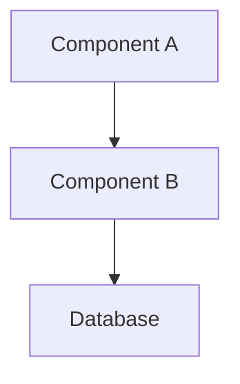
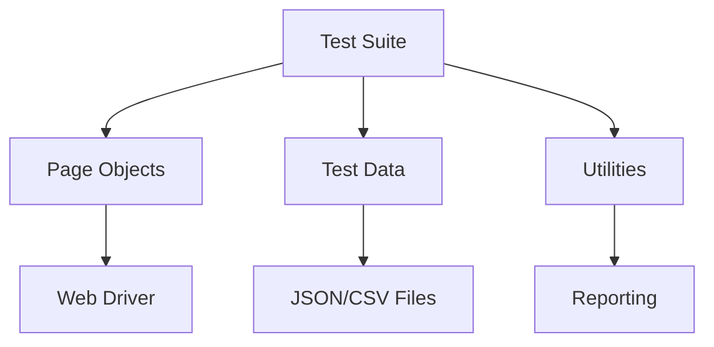

# Documentation Templates for GitHub Copilot Knowledge Hub

## Template 1: Custom Feature Development

```markdown
---
title: [Feature Name]
category: Custom Development
author: [Your Name]
date_created: YYYY-MM-DD
date_updated: YYYY-MM-DD
tags: [feature, backend, frontend, api]
related_docs: [link1, link2]
copilot_friendly: true
---

# [Feature Name]

## Overview
Brief description of the feature and its business value.

## Business Requirements
- Requirement 1
- Requirement 2
- Requirement 3

## Technical Design

### Architecture


### Components Involved
| Component | Responsibility | Technology |
|-----------|---------------|------------|
| Frontend | UI/UX | React/Angular |
| Backend | Business Logic | Java/Python |
| Database | Data Persistence | PostgreSQL |

### Data Flow
1. Step 1: User action triggers...
2. Step 2: Backend processes...
3. Step 3: Response returned...

## Implementation Guide

### Prerequisites
- Required libraries/dependencies
- Environment setup
- Access permissions needed

### Code Structure
```
feature-name/
├── controller/
├── service/
├── repository/
└── model/
```

### Key Code Snippets

#### Controller Example
```java
// GitHub Copilot Context: RESTful API endpoint for [feature]
@RestController
@RequestMapping("/api/v1/feature")
public class FeatureController {
    
    @Autowired
    private FeatureService featureService;
    
    @GetMapping("/{id}")
    public ResponseEntity<FeatureDTO> getFeature(@PathVariable Long id) {
        // Implementation details
        return ResponseEntity.ok(featureService.getFeatureById(id));
    }
}
```

#### Service Layer
```java
// GitHub Copilot Context: Business logic for [feature]
@Service
public class FeatureService {
    
    @Autowired
    private FeatureRepository repository;
    
    public FeatureDTO getFeatureById(Long id) {
        // Add validation, error handling, and business rules
        return repository.findById(id)
            .map(this::convertToDTO)
            .orElseThrow(() -> new FeatureNotFoundException(id));
    }
}
```

## Testing Strategy

### Unit Tests
```java
// GitHub Copilot Context: Unit test for FeatureService
@Test
void testGetFeatureById_Success() {
    // Arrange
    Long featureId = 1L;
    Feature mockFeature = createMockFeature(featureId);
    
    // Act
    FeatureDTO result = featureService.getFeatureById(featureId);
    
    // Assert
    assertEquals(featureId, result.getId());
}
```

### Integration Tests
- Test scenario 1
- Test scenario 2

## Configuration

### Application Properties
```properties
# Feature-specific configurations
feature.enabled=true
feature.max-connections=100
```

### Environment Variables
- `FEATURE_API_KEY`: API key for external service
- `FEATURE_TIMEOUT`: Request timeout in milliseconds

## Deployment Notes
- Pre-deployment checklist
- Database migration scripts
- Rollback procedure

## Known Issues & Limitations
- Issue 1: Description and workaround
- Issue 2: Description and workaround

## References
- [Related Documentation](link)
- [API Specification](link)
- [Design Document](link)

## Changelog
| Date | Author | Changes |
|------|--------|---------|
| 2025-01-15 | John Doe | Initial version |
| 2025-02-01 | Jane Smith | Added error handling |
```

---

## Template 2: Application Configuration

```markdown
---
title: [Configuration Use Case Name]
category: Application Configuration
author: [Your Name]
date_created: YYYY-MM-DD
date_updated: YYYY-MM-DD
tags: [configuration, setup, vendor-app]
related_docs: [link1, link2]
copilot_friendly: true
---

# [Configuration Use Case Name]

## Purpose
What business problem does this configuration solve?

## Prerequisites
- Required modules/licenses
- User permissions needed
- Dependent configurations

## Configuration Steps

### Step 1: [Step Name]
**Navigation**: Path > To > Configuration > Screen

**Actions**:
1. Click on [Button Name]
2. Enter the following values:
   - Field 1: `value1`
   - Field 2: `value2`
3. Click Save

**Screenshot Reference**: `images/config-step1.png`

**Copilot Tip**: When configuring similar fields, use pattern: `field-name: value`

### Step 2: [Step Name]
**Navigation**: Path > To > Next > Screen

**Configuration Values**:
```json
{
  "parameter1": "value1",
  "parameter2": "value2",
  "nestedConfig": {
    "subParam1": "subValue1"
  }
}
```

### Step 3: Validation
**How to verify**:
1. Navigate to validation screen
2. Check for expected values
3. Test the functionality

**Expected Result**:
- System behaves as described
- No error messages
- Data saved correctly

## Configuration Reference

### Key Settings
| Setting | Value | Purpose |
|---------|-------|---------|
| Setting1 | Value1 | Explanation |
| Setting2 | Value2 | Explanation |

### Business Rules
- Rule 1: When X happens, system does Y
- Rule 2: Field A is required when B is selected

## Common Issues & Troubleshooting

### Issue 1: [Error Message]
**Cause**: Description of cause
**Solution**: Step-by-step resolution
```bash
# Commands to resolve if applicable
command --flag value
```

### Issue 2: [Unexpected Behavior]
**Symptom**: What users see
**Root Cause**: Why it happens
**Fix**: How to correct it

## Testing Checklist
- [ ] Configuration saved successfully
- [ ] Validation rules work as expected
- [ ] Integration with other modules tested
- [ ] User permissions verified
- [ ] Documentation updated

## Related Configurations
- [Configuration A](link): Brief description
- [Configuration B](link): Brief description

## Impact Analysis
- **Affected Modules**: List of modules impacted
- **Affected Users**: User groups affected
- **Performance Considerations**: Any performance implications

## Rollback Procedure
In case configuration needs to be reverted:
1. Step 1
2. Step 2
3. Step 3

## References
- Vendor Documentation: [link]
- Internal Wiki: [link]
- Support Ticket: [ticket-number]

## Changelog
| Date | Author | Changes |
|------|--------|---------|
| 2025-01-20 | Config Team | Initial setup |
```

---

## Template 3: Functional Testing

```markdown
---
title: [Test Case ID] - [Test Case Name]
category: Functional Testing
author: [Your Name]
date_created: YYYY-MM-DD
date_updated: YYYY-MM-DD
tags: [testing, functional, module-name]
test_priority: High/Medium/Low
test_type: Positive/Negative/Boundary
related_docs: [requirement-doc, feature-doc]
copilot_friendly: true
---

# Test Case: [Test Case Name]

## Test Case Information
- **Test Case ID**: TC-001
- **Module**: [Module Name]
- **Feature**: [Feature Name]
- **Priority**: High/Medium/Low
- **Test Type**: Functional/Integration/Regression
- **Automation Status**: Manual/Automated/Planned

## Objective
What is this test validating?

## Preconditions
- User has [specific role/permission]
- System is in [specific state]
- Test data is prepared
- Required configurations are in place

## Test Data
```yaml
user:
  username: testuser001
  role: Admin
  
test_record:
  id: 12345
  status: Active
  value: 1000
```

## Test Steps

| Step | Action | Expected Result | Actual Result | Status |
|------|--------|-----------------|---------------|--------|
| 1 | Navigate to [Screen Name] | Screen loads successfully | | |
| 2 | Enter value in [Field Name]: `test_value` | Field accepts input | | |
| 3 | Click [Button Name] | Confirmation message displayed | | |
| 4 | Verify [Expected Outcome] | Data saved correctly | | |

## Detailed Step Instructions

### Step 1: Navigation
```
1. Login as: testuser001
2. Click Menu > Module > Screen
3. Wait for page load
```

### Step 2: Data Entry
```
Field Mapping:
- Customer Name: "ABC Corporation"
- Amount: 1000.00
- Date: Current Date
- Status: "Active"
```

### Step 3: Submission
```
1. Click "Submit" button
2. Wait for processing (max 5 seconds)
3. Observe confirmation message
```

### Step 4: Verification
```
Validation Points:
- Record appears in list view
- Status shows as "Active"
- Audit log entry created
- Email notification sent (if applicable)
```

## Expected Results
Comprehensive description of what should happen when test passes.

## Actual Results
[To be filled during execution]

## Test Evidence
- Screenshot 1: Initial state
- Screenshot 2: After action
- Screenshot 3: Final result
- Log files: `evidence/TC-001-logs.txt`

## Validation Queries
```sql
-- GitHub Copilot Context: Validation query for test case TC-001
SELECT id, status, created_date 
FROM customer_records 
WHERE customer_name = 'ABC Corporation'
AND created_date >= CURRENT_DATE;
```

## Negative Test Scenarios

### Scenario 1: Invalid Input
**Action**: Enter invalid value in [Field]
**Expected**: Validation error displayed
**Error Message**: "[Expected error text]"

### Scenario 2: Missing Required Field
**Action**: Leave [Field] empty
**Expected**: Form submission prevented
**Error Message**: "[Expected error text]"

## Boundary Conditions
- Minimum value: [value]
- Maximum value: [value]
- Special characters: Test with @, #, $, etc.
- Length limits: Test with min/max length strings

## Dependencies
- **Depends On**: [TC-XXX] must pass first
- **Blocked By**: Known issue [BUG-XXX]
- **Related Tests**: [TC-YYY], [TC-ZZZ]

## Test Environment
- **Environment**: QA/Staging/Production
- **Browser**: Chrome 120+ / Firefox 115+
- **OS**: Windows 10/11, macOS
- **Test Data Set**: Dataset-001

## Execution History
| Date | Tester | Result | Build | Notes |
|------|--------|--------|-------|-------|
| 2025-02-01 | John Doe | Pass | v2.1.0 | All steps passed |
| 2025-02-15 | Jane Smith | Fail | v2.1.1 | Step 3 failed - Bug logged |

## Defects Found
- [BUG-001](link): Description
- [BUG-002](link): Description

## Automation Notes
```python
# GitHub Copilot Context: Automation script for TC-001
def test_customer_creation():
    """
    Automated test for customer record creation
    """
    # Navigate to page
    driver.get("https://app.example.com/customers")
    
    # Enter test data
    driver.find_element(By.ID, "customerName").send_keys("ABC Corporation")
    driver.find_element(By.ID, "amount").send_keys("1000.00")
    
    # Submit form
    driver.find_element(By.ID, "submitBtn").click()
    
    # Verify result
    assert "Success" in driver.find_element(By.ID, "message").text
```

## References
- Requirements: [REQ-001](link)
- User Story: [US-123](link)
- Design Document: [link]

## Changelog
| Date | Author | Changes |
|------|--------|---------|
| 2025-01-25 | QA Team | Test case created |
| 2025-02-05 | QA Team | Added negative scenarios |
```

---

## Template 4: Test Automation

```markdown
---
title: [Automation Script Name]
category: Test Automation
author: [Your Name]
date_created: YYYY-MM-DD
date_updated: YYYY-MM-DD
tags: [automation, selenium, api, framework-name]
framework: Selenium/RestAssured/Playwright
language: Java/Python/JavaScript
related_docs: [test-case-doc, framework-doc]
copilot_friendly: true
---

# Automation Script: [Script Name]

## Overview
Purpose and scope of this automation script.

## Test Coverage
- Feature: [Feature Name]
- Test Cases Covered: TC-001, TC-002, TC-003
- Test Type: UI/API/Integration/E2E

## Prerequisites

### Environment Setup
```bash
# Install dependencies
pip install selenium pytest
npm install playwright @playwright/test

# Set environment variables
export TEST_URL=https://qa.example.com
export TEST_USER=automation_user
export TEST_PASS=secure_password
```

### Test Data Requirements
- Test user accounts
- Sample data files
- API credentials
- Database access

## Framework Architecture



## Script Structure

### File Organization
```
automation-project/
├── tests/
│   ├── test_customer_creation.py
│   └── test_order_processing.py
├── pages/
│   ├── login_page.py
│   └── customer_page.py
├── data/
│   └── test_data.json
├── utils/
│   ├── driver_factory.py
│   └── reporting.py
└── config/
    └── config.yaml
```

## Complete Script Code

### Main Test Script
```python
# GitHub Copilot Context: Selenium test automation for customer creation
import pytest
from selenium import webdriver
from selenium.webdriver.common.by import By
from selenium.webdriver.support.ui import WebDriverWait
from selenium.webdriver.support import expected_conditions as EC
from pages.login_page import LoginPage
from pages.customer_page import CustomerPage
from utils.test_data import TestData

class TestCustomerCreation:
    """
    Test suite for customer creation functionality
    """
    
    @pytest.fixture(scope="function")
    def setup(self):
        """Setup test environment before each test"""
        self.driver = webdriver.Chrome()
        self.driver.maximize_window()
        self.driver.get("https://qa.example.com")
        yield
        self.driver.quit()
    
    def test_create_new_customer_success(self, setup):
        """
        Test Case: TC-001 - Create new customer with valid data
        """
        # Arrange
        test_data = TestData.get_customer_data("valid_customer")
        login_page = LoginPage(self.driver)
        customer_page = CustomerPage(self.driver)
        
        # Act - Login
        login_page.login("automation_user", "password123")
        
        # Act - Navigate to customer creation
        customer_page.navigate_to_create_customer()
        
        # Act - Fill customer details
        customer_page.enter_customer_name(test_data['name'])
        customer_page.enter_customer_email(test_data['email'])
        customer_page.select_customer_type(test_data['type'])
        customer_page.click_submit()
        
        # Assert
        success_message = customer_page.get_success_message()
        assert "Customer created successfully" in success_message
        
        # Verify in database
        customer_id = customer_page.get_created_customer_id()
        assert self.verify_customer_in_db(customer_id)
    
    def test_create_customer_validation_errors(self, setup):
        """
        Test Case: TC-002 - Validation errors for invalid data
        """
        login_page = LoginPage(self.driver)
        customer_page = CustomerPage(self.driver)
        
        login_page.login("automation_user", "password123")
        customer_page.navigate_to_create_customer()
        
        # Test with empty name
        customer_page.enter_customer_name("")
        customer_page.click_submit()
        
        error_message = customer_page.get_error_message()
        assert "Customer name is required" in error_message
    
    def verify_customer_in_db(self, customer_id):
        """Helper method to verify customer in database"""
        # Database verification logic
        return True
```

### Page Object Model

```python
# GitHub Copilot Context: Page Object for customer management page
from selenium.webdriver.common.by import By
from selenium.webdriver.support.ui import WebDriverWait
from selenium.webdriver.support import expected_conditions as EC

class CustomerPage:
    """Page Object for Customer Management page"""
    
    # Locators
    CREATE_CUSTOMER_BTN = (By.ID, "createCustomerBtn")
    CUSTOMER_NAME_INPUT = (By.ID, "customerName")
    CUSTOMER_EMAIL_INPUT = (By.ID, "customerEmail")
    CUSTOMER_TYPE_SELECT = (By.ID, "customerType")
    SUBMIT_BTN = (By.ID, "submitBtn")
    SUCCESS_MESSAGE = (By.CLASS_NAME, "success-message")
    ERROR_MESSAGE = (By.CLASS_NAME, "error-message")
    
    def __init__(self, driver):
        self.driver = driver
        self.wait = WebDriverWait(driver, 10)
    
    def navigate_to_create_customer(self):
        """Navigate to customer creation form"""
        create_btn = self.wait.until(
            EC.element_to_be_clickable(self.CREATE_CUSTOMER_BTN)
        )
        create_btn.click()
    
    def enter_customer_name(self, name):
        """Enter customer name"""
        name_input = self.wait.until(
            EC.presence_of_element_located(self.CUSTOMER_NAME_INPUT)
        )
        name_input.clear()
        name_input.send_keys(name)
    
    def enter_customer_email(self, email):
        """Enter customer email"""
        email_input = self.driver.find_element(*self.CUSTOMER_EMAIL_INPUT)
        email_input.clear()
        email_input.send_keys(email)
    
    def select_customer_type(self, customer_type):
        """Select customer type from dropdown"""
        from selenium.webdriver.support.ui import Select
        select = Select(self.driver.find_element(*self.CUSTOMER_TYPE_SELECT))
        select.select_by_visible_text(customer_type)
    
    def click_submit(self):
        """Click submit button"""
        submit_btn = self.driver.find_element(*self.SUBMIT_BTN)
        submit_btn.click()
    
    def get_success_message(self):
        """Get success message text"""
        message = self.wait.until(
            EC.presence_of_element_located(self.SUCCESS_MESSAGE)
        )
        return message.text
    
    def get_error_message(self):
        """Get error message text"""
        message = self.wait.until(
            EC.presence_of_element_located(self.ERROR_MESSAGE)
        )
        return message.text
    
    def get_created_customer_id(self):
        """Extract customer ID from success message"""
        message = self.get_success_message()
        # Parse customer ID from message
        return message.split("ID: ")[1]
```

### Test Data Management

```python
# GitHub Copilot Context: Test data management utility
import json

class TestData:
    """Manage test data for automation scripts"""
    
    @staticmethod
    def get_customer_data(data_key):
        """Load customer test data"""
        with open('data/customer_data.json', 'r') as f:
            data = json.load(f)
        return data.get(data_key, {})
    
    @staticmethod
    def generate_unique_email():
        """Generate unique email for testing"""
        import time
        timestamp = int(time.time())
        return f"test_{timestamp}@example.com"
```

### Configuration

```yaml
# config.yaml
# GitHub Copilot Context: Test automation configuration
environments:
  qa:
    url: https://qa.example.com
    database:
      host: qa-db.example.com
      port: 5432
  staging:
    url: https://staging.example.com
    database:
      host: staging-db.example.com
      port: 5432

selenium:
  browser: chrome
  headless: false
  implicit_wait: 10
  page_load_timeout: 30

reporting:
  output_dir: ./reports
  screenshot_on_failure: true
  video_recording: false
```

## Execution Instructions

### Run All Tests
```bash
# Run with pytest
pytest tests/ -v --html=reports/report.html

# Run specific test
pytest tests/test_customer_creation.py::TestCustomerCreation::test_create_new_customer_success

# Run with markers
pytest -m smoke -v
pytest -m regression -v
```

### CI/CD Integration
```yaml
# .github/workflows/automation.yml
name: Automation Tests

on:
  push:
    branches: [ main, develop ]
  schedule:
    - cron: '0 2 * * *'  # Run daily at 2 AM

jobs:
  test:
    runs-on: ubuntu-latest
    steps:
      - uses: actions/checkout@v2
      - name: Set up Python
        uses: actions/setup-python@v2
        with:
          python-version: '3.9'
      - name: Install dependencies
        run: |
          pip install -r requirements.txt
      - name: Run tests
        run: |
          pytest tests/ -v --html=reports/report.html
      - name: Upload report
        uses: actions/upload-artifact@v2
        with:
          name: test-report
          path: reports/
```

## Reporting

### Test Results Format
```
============================== test session starts ===============================
tests/test_customer_creation.py::TestCustomerCreation::test_create_new_customer_success PASSED
tests/test_customer_creation.py::TestCustomerCreation::test_create_customer_validation_errors PASSED

============================== 2 passed in 15.23s ================================
```

### Failure Handling
- Screenshots captured on failure
- Detailed error logs
- Stack trace included
- Video recording (if enabled)

## Maintenance

### Best Practices
- Keep page objects updated with UI changes
- Use explicit waits instead of implicit waits
- Implement retry logic for flaky tests
- Regular cleanup of test data
- Update selectors when application changes

### Common Issues

#### Issue 1: Element Not Found
```python
# Use better wait strategies
from selenium.webdriver.support.ui import WebDriverWait
from selenium.webdriver.support import expected_conditions as EC

element = WebDriverWait(driver, 10).until(
    EC.presence_of_element_located((By.ID, "elementId"))
)
```

#### Issue 2: Stale Element Reference
```python
# Refetch element before interaction
def click_element_safely(driver, locator):
    max_attempts = 3
    for attempt in range(max_attempts):
        try:
            element = driver.find_element(*locator)
            element.click()
            break
        except StaleElementReferenceException:
            if attempt == max_attempts - 1:
                raise
```

## Performance Optimization
- Use parallel execution: `pytest -n 4`
- Implement smart waits
- Minimize browser interactions
- Reuse browser sessions where appropriate
- Use headless mode for CI/CD

## References
- Framework Documentation: [link]
- Selenium Documentation: https://selenium.dev
- pytest Documentation: https://pytest.org

## Changelog
| Date | Author | Changes |
|------|--------|---------|
| 2025-02-01 | Automation Team | Initial script |
| 2025-02-10 | Automation Team | Added POM pattern |
```

---

## Usage Guidelines

### How to Use These Templates

1. **Copy the appropriate template** for your documentation need
2. **Replace placeholders** (text in square brackets) with actual content
3. **Use GitHub Copilot** to help fill in sections